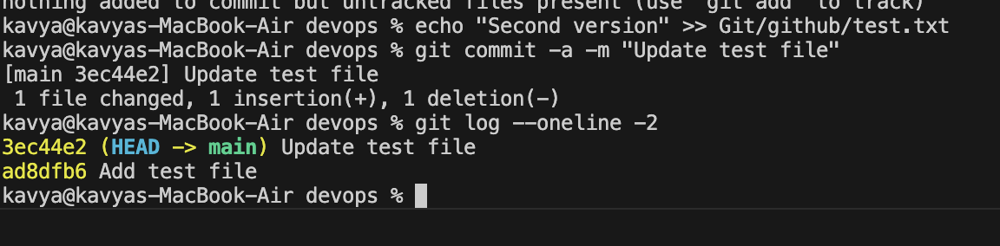
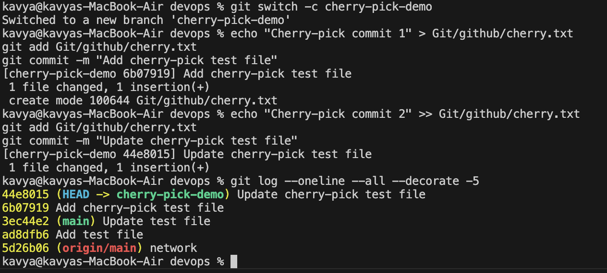
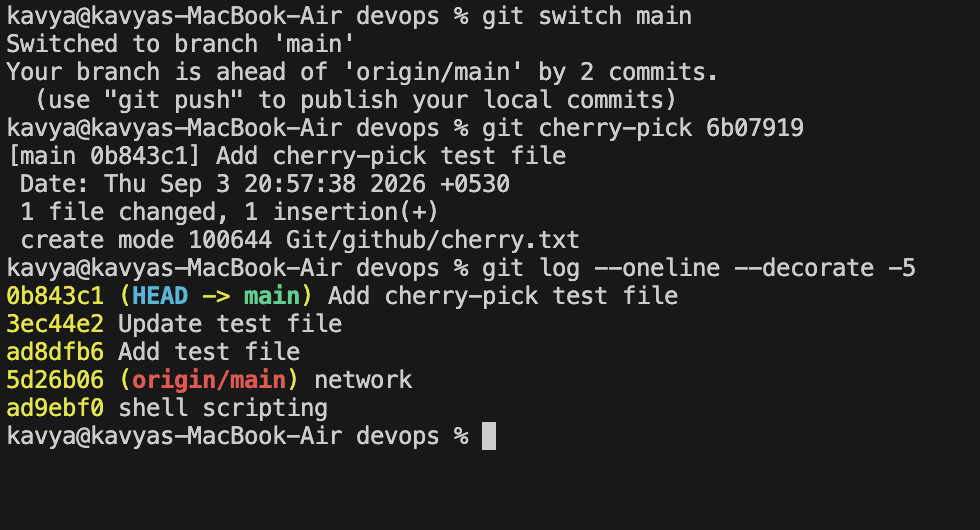

## Task 1: `git commit -a -m`

### Objective

Practice `git commit -a -m` and understand how it differs from `git commit -m`.

### `git commit -m`

The `git commit -m "message"` command creates a commit using the changes that have already been staged with `git add`.

Example:

```bash
git add Git/github/test.txt
git commit -m "Add test file"
```

### `git commit -a -m`

The `git commit -a -m "message"` command stages and commits changes to already tracked files in one step.

Example:

```bash
echo "Second version" >> Git/github/test.txt
git commit -a -m "Update test file"
```

### Difference

* `git commit -m` commits only changes that are already staged.
* `git commit -a -m` automatically stages modifications and deletions of already tracked files and then commits them.
* `git commit -a -m` does not automatically add new untracked files.

### Evidence



---

## Task 2: Git Cherry-Pick

### Step 1: Create commits on main

First, commits were created on the main branch.

```bash
git commit -m "Add test file"
git commit -a -m "Update test file"
```

The commits were verified using:

```bash
git log --oneline -2
```

Output showed:

```text
3ec44e2 Update test file
ad8dfb6 Add test file
```

### Step 2: Create a new branch

A new branch called `cherry-pick-demo` was created:

```bash
git switch -c cherry-pick-demo
```

### Step 3: Create commits on the new branch

A new file was created and committed:

```bash
echo "Cherry-pick commit 1" > Git/github/cherry.txt
git add Git/github/cherry.txt
git commit -m "Add cherry-pick test file"
```

A second commit was then created:

```bash
echo "Cherry-pick commit 2" >> Git/github/cherry.txt
git add Git/github/cherry.txt
git commit -m "Update cherry-pick test file"
```

The branch history was checked using:

```bash
git log --oneline --all --decorate -5
```

### Evidence



### Step 4: Cherry-pick a specific commit

The main branch was checked out:

```bash
git switch main
```

The first cherry-pick commit was identified as:

```text
6b07919 Add cherry-pick test file
```

It was then applied to main using:

```bash
git cherry-pick 6b07919
```

The cherry-pick created a new commit on main:

```text
0b843c1 Add cherry-pick test file
```

### Evidence



### Step 5: Verify the cherry-pick

The commit history was checked again:

```bash
git log --oneline --decorate -5
```

The output showed:

```text
0b843c1 (HEAD -> main) Add cherry-pick test file
3ec44e2 Update test file
ad8dfb6 Add test file
5d26b06 (origin/main) network
ad9ebf0 shell scripting
```

### Evidence


This confirms that the selected commit from cherry-pick-demo was successfully applied to the main branch.