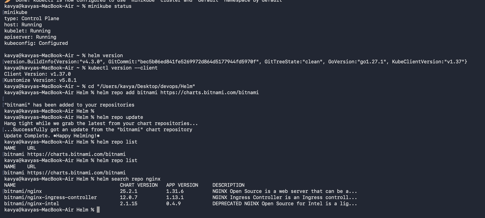
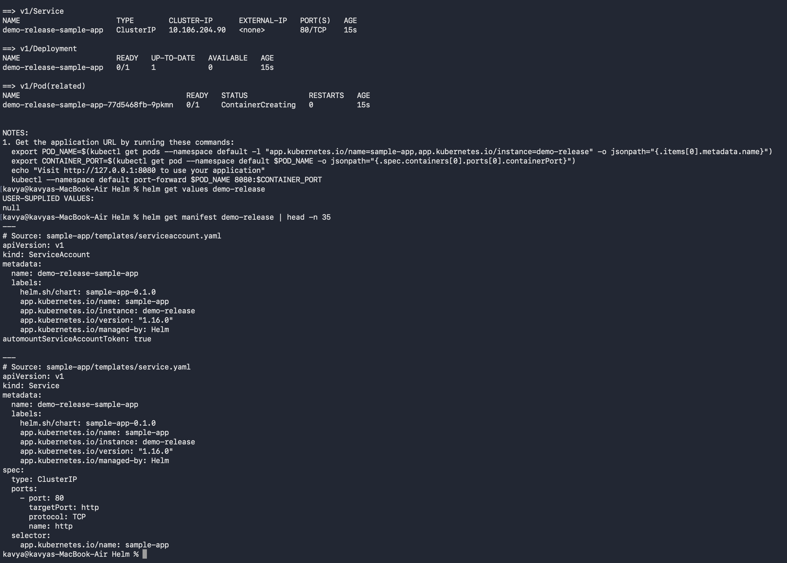
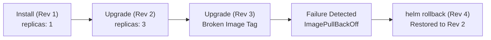
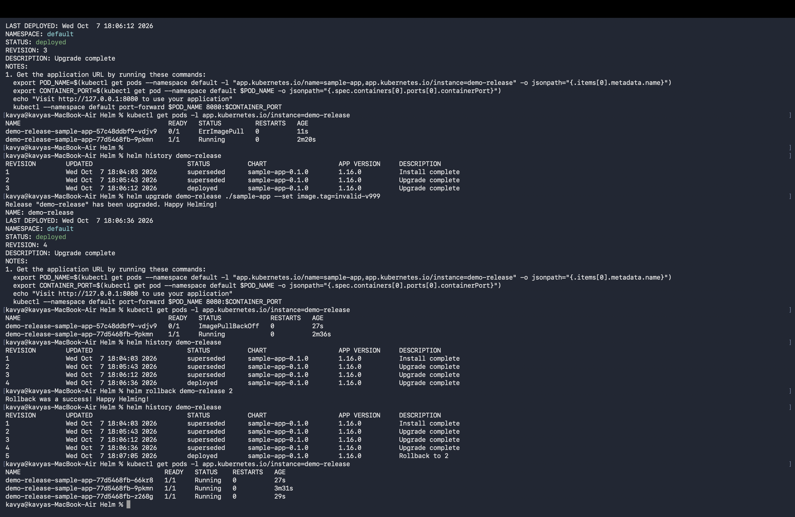

# Session 15: Helm Package Manager

## Student Details

* **Name:** Kavya Raghavendran
* **Enrollment Number:** 24bcs10324

---

## Overview

Helm is the package manager for Kubernetes. It simplifies application deployment and management by packaging multiple related Kubernetes manifests into reusable, versioned bundles called **Charts**.

In this session, we cover:
1. **Task 1: Helm Core Commands** — Repository management, chart creation, installation, inspection, status checking, and retrieval.
2. **Task 2: Release Lifecycle & Rollback Workflow** — Multi-revision upgrades, release history tracking, rollback simulation, and fault recovery.
3. **Task 3: Mini Project (Notes App Chart)** — Building a production-ready custom Helm chart from scratch with environment-specific values (`values.yaml` vs `values-prod.yaml`), template parametrization, rollout testing, bad upgrade simulation (`ImagePullBackOff`), and revision rollback.

---

## Task 1: Helm Core Commands

### 1.1 Repository Management & Searching Charts

```bash
# Add external Bitnami chart repository
helm repo add bitnami https://charts.bitnami.com/bitnami

# Update local cache of available charts
helm repo update

# List active repositories
helm repo list

# Search for available charts in repository
helm search repo nginx
```



* **`helm repo add`**: Adds a reference to a remote chart repository.
* **`helm repo update`**: Fetches the latest chart versions and indexes from all configured repositories.
* **`helm search repo`**: Searches local cached repository indexes for matching chart names or keywords.

---

### 1.2 Chart Creation, Deployment & Inspection

```bash
# Generate starter chart boilerplate
helm create sample-app

# Deploy chart as a release
helm install demo-release ./sample-app

# List all active releases across namespaces
helm list

# Check real-time release status and rendered resources
helm status demo-release

# Inspect user-supplied values and rendered manifests
helm get values demo-release
helm get manifest demo-release
```



* **`helm create`**: Scaffolds a standard chart directory structure (`Chart.yaml`, `values.yaml`, `templates/`).
* **`helm install`**: Packages and deploys a chart instance onto the Kubernetes cluster as a named release.
* **`helm list`**: Displays deployed releases, revision numbers, update timestamps, and chart versions.
* **`helm status`**: Provides health status, namespace, and notes for a specific release.
* **`helm get`**: Retrieves configuration state (`values`), generated Kubernetes YAML (`manifest`), or complete metadata (`all`).

---

## Task 2: Helm Release Lifecycle & Rollback Workflow

### Workflow Execution



```bash
# Step 1: Upgrade to Revision 2 (Scale replicaCount to 3)
helm upgrade demo-release ./sample-app --set replicaCount=3
kubectl get pods -l app.kubernetes.io/instance=demo-release

# Step 2: Upgrade to Revision 3 (Simulate failure with non-existent image tag)
helm upgrade demo-release ./sample-app --set image.tag=invalid-v999
kubectl get pods -l app.kubernetes.io/instance=demo-release

# Step 3: View full release history
helm history demo-release

# Step 4: Instant Rollback to Revision 2
helm rollback demo-release 2

# Step 5: Verify healthy status & clean up
helm history demo-release
kubectl get pods -l app.kubernetes.io/instance=demo-release
helm uninstall demo-release
```



* **Atomic Upgrades & Revision History:** Every `helm upgrade` creates an immutable revision record in cluster secrets/configmaps.
* **Instant Rollback:** `helm rollback <release> <revision>` immediately rolls back deployment state and configuration without requiring manual YAML surgery.

---

## Task 3: Mini Project — Package and Deploy the Notes App

A custom Helm chart was developed from scratch to package and manage the multi-tier **Notes App**.

### Chart Directory Layout

```
notes-chart/
├── Chart.yaml
├── values.yaml
├── values-prod.yaml
└── templates/
    ├── configmap.yaml
    ├── deployment.yaml
    └── service.yaml
```

All chart source files are maintained under [`notes-chart/`](notes-chart).

---

### Step 1: Chart Metadata (`Chart.yaml`)

```yaml
apiVersion: v2
name: notes-chart
description: A simple Notes application Helm chart
type: application
version: 0.1.0
appVersion: "1.0"
```

---

### Step 2: Values Configurations

#### Development Values (`values.yaml`)
```yaml
replicaCount: 1

image:
  repository: nginx
  tag: "1.24"

service:
  port: 80
  nodePort: 30090

app:
  name: notes-app
  environment: development
```

#### Production Overrides (`values-prod.yaml`)
```yaml
replicaCount: 3

image:
  repository: nginx
  tag: "1.25"

service:
  port: 80
  nodePort: 30090

app:
  name: notes-app
  environment: production
```

---

### Step 3: Kubernetes Templates

#### `templates/configmap.yaml`
```yaml
apiVersion: v1
kind: ConfigMap
metadata:
  name: {{ .Release.Name }}-config
data:
  APP_NAME: {{ .Values.app.name | quote }}
  ENVIRONMENT: {{ .Values.app.environment | quote }}
```

#### `templates/deployment.yaml`
```yaml
apiVersion: apps/v1
kind: Deployment
metadata:
  name: {{ .Release.Name }}-deploy
  labels:
    app: {{ .Release.Name }}
    environment: {{ .Values.app.environment }}
spec:
  replicas: {{ .Values.replicaCount }}
  selector:
    matchLabels:
      app: {{ .Release.Name }}
  template:
    metadata:
      labels:
        app: {{ .Release.Name }}
    spec:
      containers:
        - name: notes
          image: "{{ .Values.image.repository }}:{{ .Values.image.tag }}"
          ports:
            - containerPort: {{ .Values.service.port }}
          envFrom:
            - configMapRef:
                name: {{ .Release.Name }}-config
```

#### `templates/service.yaml`
```yaml
apiVersion: v1
kind: Service
metadata:
  name: {{ .Release.Name }}-svc
spec:
  type: NodePort
  selector:
    app: {{ .Release.Name }}
  ports:
    - port: {{ .Values.service.port }}
      targetPort: {{ .Values.service.port }}
      nodePort: {{ .Values.service.nodePort }}
```

---

### Step 4: Verification & Deployment Workflow

```bash
# 1. Lint the chart
helm lint notes-chart

# 2. Render templates locally (Dry-run validation)
helm template notes-dev notes-chart

# 3. Deploy Development Release
helm install notes-dev notes-chart
kubectl get pods,svc,configmap -l app=notes-dev

# 4. Upgrade to Production Values (3 replicas, nginx 1.25)
helm upgrade notes-dev notes-chart -f notes-chart/values-prod.yaml
kubectl get pods -l app=notes-dev

# 5. Check Revision History
helm history notes-dev

# 6. Simulate Bad Upgrade (Broken Image Tag)
helm upgrade notes-dev notes-chart --set image.tag=broken-tag-does-not-exist
kubectl get pods -l app=notes-dev

# 7. Rollback to Healthy Revision 2
helm rollback notes-dev 2
kubectl get pods -l app=notes-dev

# 8. Teardown
helm uninstall notes-dev
```

---

## Helm Command Quick Reference

| Command | Description | Example |
|---|---|---|
| `helm create <name>` | Scaffolds a new chart with boilerplate | `helm create notes-chart` |
| `helm lint <chart>` | Examines chart for syntax & best practice errors | `helm lint ./notes-chart` |
| `helm template <rel> <chart>` | Locally renders chart templates to stdout | `helm template test ./notes-chart` |
| `helm install <rel> <chart>` | Deploys chart as a named release | `helm install notes-dev ./notes-chart` |
| `helm upgrade <rel> <chart>` | Upgrades release with new chart/values | `helm upgrade notes-dev ./notes-chart -f values-prod.yaml` |
| `helm history <rel>` | Prints revision history and status | `helm history notes-dev` |
| `helm rollback <rel> <rev>` | Reverts release to a specific revision | `helm rollback notes-dev 2` |
| `helm uninstall <rel>` | Deletes all Kubernetes resources for release | `helm uninstall notes-dev` |
| `helm repo add/list/update` | Manages remote chart repository registries | `helm repo add bitnami https://charts.bitnami.com/bitnami` |
| `helm search repo <query>` | Finds charts in configured repositories | `helm search repo nginx` |
