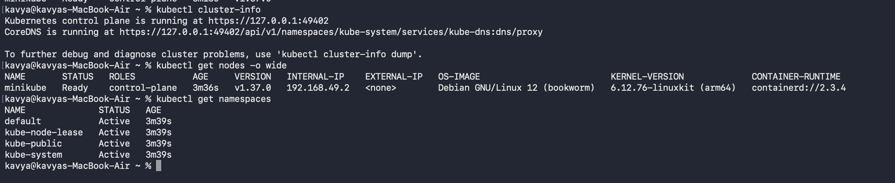
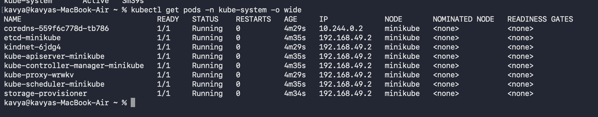
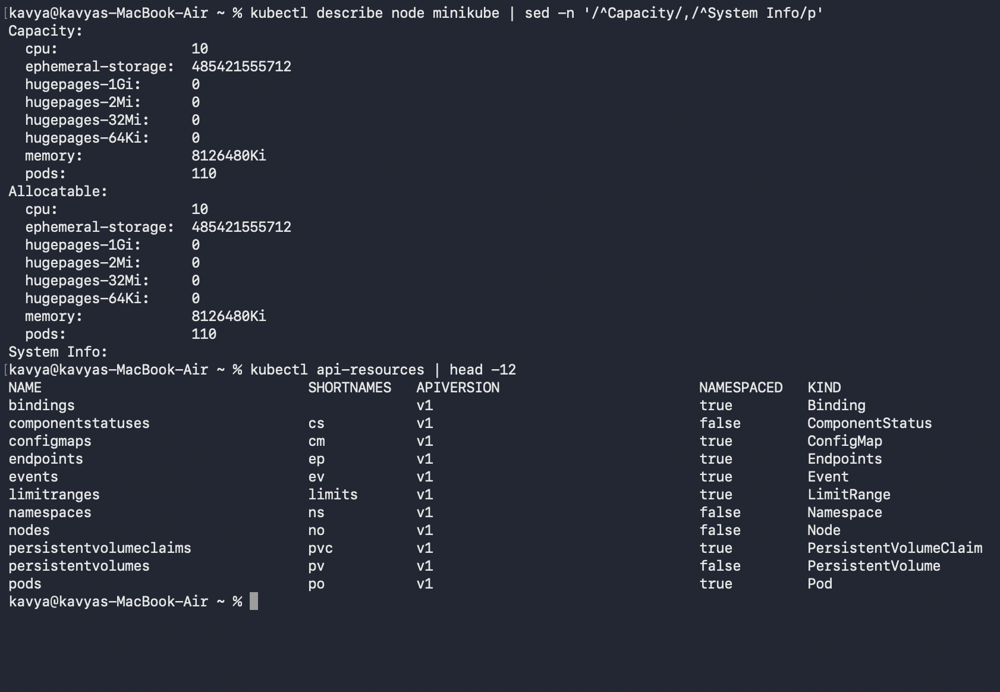
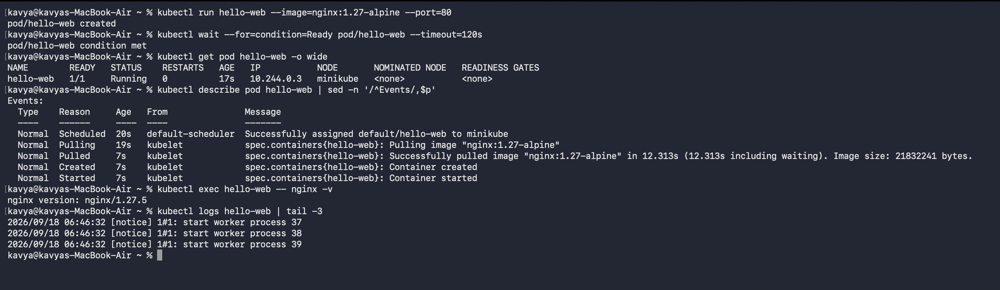
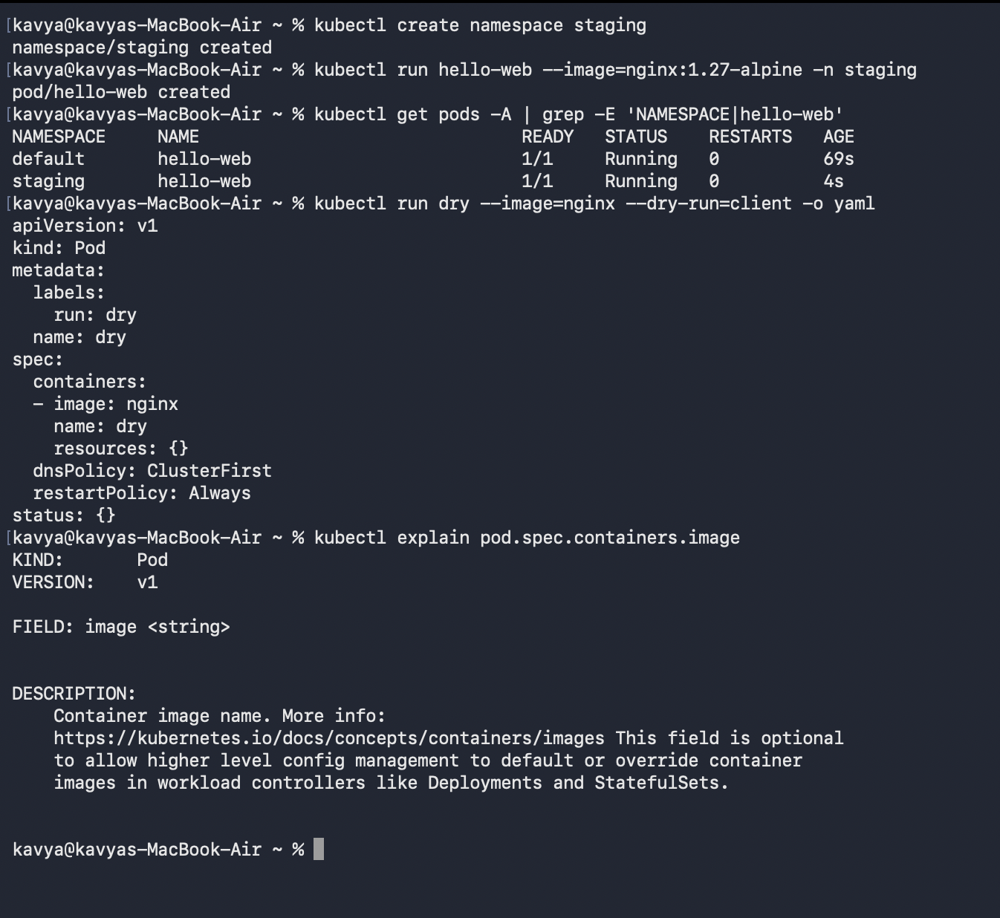

# Kubernetes Fundamentals

## Student Details

* **Name:** Kavya Raghavendran
* **Enrollment Number:** 24bcs10324

---

## Overview

Hands-on exploration of core Kubernetes concepts performed on a local single-node Minikube cluster using the Docker driver (Kubernetes v1.37.0).

```bash
minikube start --driver=docker
```

---

## 1. Kubernetes Control Plane Architecture

Kubernetes operates on a **declarative** model: you define the desired state, and a set of independent control loops actively reconcile the actual state with the desired state.

| Component | Runs on | Description / Role |
|---|---|---|
| `kube-apiserver` | Control plane | The primary gateway into the cluster. All internal components and `kubectl` communicate via the API server; nothing talks directly to `etcd`. |
| `etcd` | Control plane | Distributed, highly available key-value store holding the complete cluster state and configuration. |
| `kube-scheduler` | Control plane | Evaluates newly created Pods without assigned nodes and selects the optimal node for execution based on resource requirements and constraints. |
| `kube-controller-manager` | Control plane | Runs controller processes (Node Controller, Replication Controller, Endpoints Controller, etc.) to drive actual state toward desired state. |
| `kubelet` | Every node | Node agent that ensures containers described in PodSpecs are running and reports container health back to the control plane. |
| `kube-proxy` | Every node | Network proxy maintaining network rules on nodes to allow network communication to Pods from inside or outside the cluster. |
| `containerd` | Every node | The underlying container runtime responsible for executing and managing container lifecycles. |
| `CoreDNS` | Cluster Add-on | In-cluster DNS server for internal service discovery and name resolution between Pods and Services. |

---

## 2. Cluster Information & Namespaces

```bash
kubectl cluster-info
kubectl get nodes -o wide
kubectl get namespaces
```



* **Single-Node Minikube:** In a local Minikube environment, the `minikube` node serves as both the control plane and worker node.
* **Default Namespaces:**
  * `default`: Default namespace for user-created objects.
  * `kube-system`: Namespace for Kubernetes system components and add-ons.
  * `kube-public`: Auto-generated, publicly readable namespace.
  * `kube-node-lease`: Holds heartbeat lease objects for node health monitoring.

---

## 3. Control Plane Components as Pods

```bash
kubectl get pods -n kube-system -o wide
```



In Kubernetes, core control plane components (`kube-apiserver`, `etcd`, `kube-controller-manager`, `kube-scheduler`) run as static Pods directly on the control plane. 

* **Host Network IPs (`192.168.49.2`):** Control plane components and node agents (`kube-proxy`, `kindnet`, `storage-provisioner`) share the host/node IP.
* **Pod Network IPs (`10.244.0.2`):** Add-ons like `coredns` receive dedicated IP addresses allocated from the virtual Pod CIDR range.

---

## 4. Node Capacity and API Surface

```bash
kubectl describe node minikube | sed -n '/^Capacity/,/^System Info/p'
kubectl api-resources | head -12
```



* **Capacity vs. Allocatable:** 
  * `Capacity` represents the physical hardware specifications of the node (CPU, Memory, maximum Pod capacity: 110).
  * `Allocatable` is the portion of resources remaining after system reservations that the scheduler can allocate to Pods.
* **API Resources (`kubectl api-resources`):** Lists all supported resource types, their short names (`po`, `cm`, `ns`, `pvc`), API versions, and whether they are namespaced or cluster-scoped (e.g., `nodes` and `persistentvolumes` are non-namespaced).

---

## 5. Pod Lifecycle & Inspection

A sample Nginx Pod was created imperatively to observe scheduling, container creation, and logging:

```bash
kubectl run hello-web --image=nginx:1.27-alpine --port=80
kubectl wait --for=condition=Ready pod/hello-web --timeout=120s
kubectl get pod hello-web -o wide
kubectl describe pod hello-web | sed -n '/^Events/,$p'
kubectl exec hello-web -- nginx -v
kubectl logs hello-web | tail -3
```



* **Lifecycle Events:** The `Events` block provides the sequential timeline:
  1. `Scheduled`: Assigned to node `minikube`.
  2. `Pulling` / `Pulled`: Image `nginx:1.27-alpine` pulled via `containerd`.
  3. `Created`: Container instantiated.
  4. `Started`: Container runtime started the process.
* **Pod Network IP:** The Pod was assigned IP `10.244.0.3` within the cluster overlay network.
* **Exec & Logs:** Verified the running Nginx version (`nginx/1.27.5`) and inspected runtime access logs.

---

## 6. Multi-Namespace Isolation & CLI Utilities

```bash
kubectl create namespace staging
kubectl run hello-web --image=nginx:1.27-alpine -n staging
kubectl get pods -A | grep -E 'NAMESPACE|hello-web'
kubectl run dry --image=nginx --dry-run=client -o yaml
kubectl explain pod.spec.containers.image
```



* **Namespace Isolation:** Created a second Pod named `hello-web` in the `staging` namespace without naming conflict, demonstrating virtual cluster isolation.
* **Dry-Run Generation (`--dry-run=client -o yaml`):** Rapidly generates clean YAML manifests without applying them to the cluster.
* **Inline Documentation (`kubectl explain`):** In-terminal API reference for inspectable schema definitions and field explanations.

---

## 7. Cleanup

```bash
kubectl delete pod hello-web --wait=false
kubectl delete namespace staging --wait=false
```

---

## `kubectl` Quick Reference

| Command | Description |
|---|---|
| `kubectl cluster-info` | Displays cluster endpoint and core service URLs |
| `kubectl get <resource> [-o wide] [-n ns] [-A]` | Lists resources with optional wide formatting and namespace filters |
| `kubectl describe <resource> <name>` | Displays detailed metadata, status, and lifecycle events |
| `kubectl logs <pod> [-f] [--tail=N]` | Streams or retrieves stdout/stderr logs from a container |
| `kubectl exec -it <pod> -- <cmd>` | Executes interactive or one-off commands inside a running container |
| `kubectl run <name> --image=` | Quickly spins up an imperative Pod for testing |
| `kubectl create namespace <name>` | Creates a new namespace partition |
| `kubectl explain <type.field>` | Queries built-in API schema documentation |
| `kubectl delete <resource> <name>` | Deletes specified Kubernetes objects |
