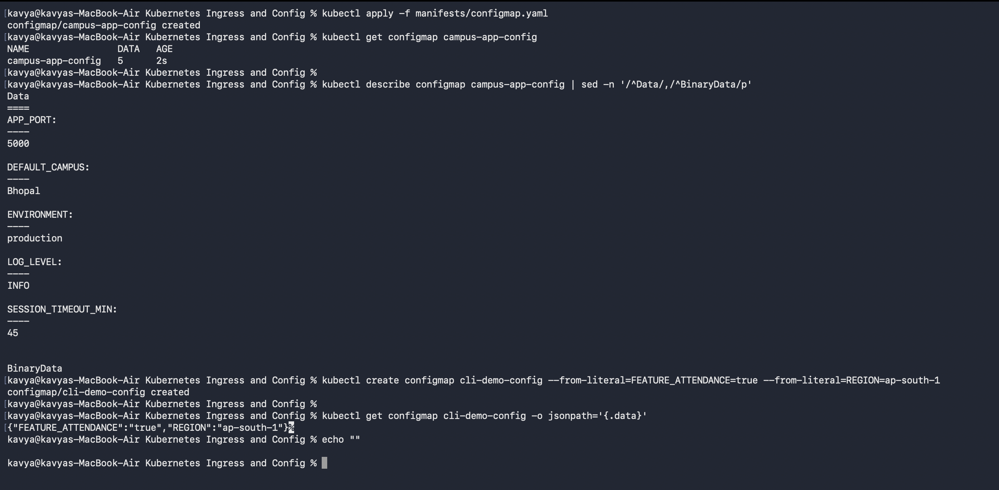
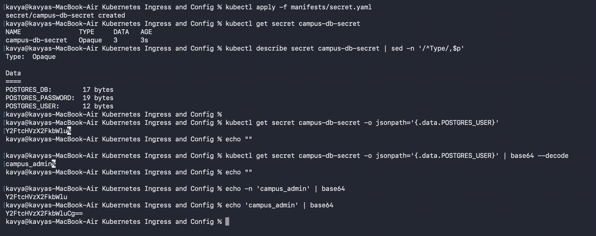
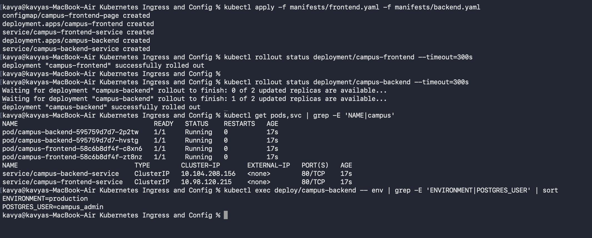
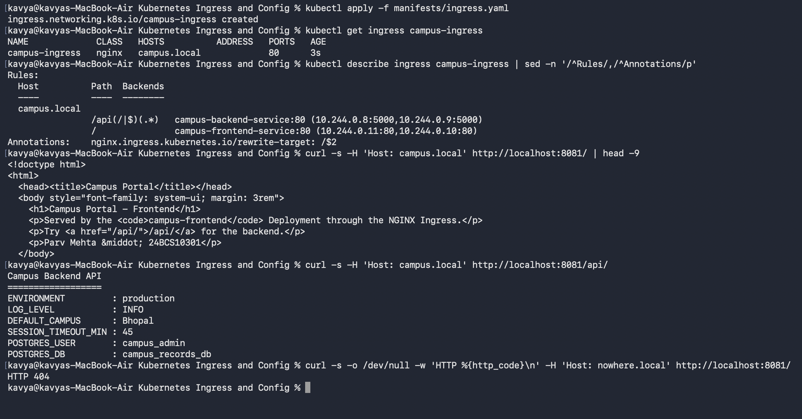

# Kubernetes Ingress, ConfigMaps, and Secrets

## Student Details

* **Name:** Kavya Raghavendran
* **Enrollment Number:** 24bcs10324

---

## Overview

This lab demonstrates externalized application configuration, sensitive credential management, and unified Layer 7 HTTP ingress routing on a local Kubernetes (Minikube) cluster.

| Object | Purpose |
|---|---|
| **ConfigMap** | Decouples non-sensitive configuration parameters (key-value pairs) from application container images. |
| **Secret** | Stores sensitive data (passwords, tokens, database credentials) as base64-encoded values. |
| **Ingress** | Defines Layer 7 HTTP/HTTPS routing rules based on hostnames and request paths across internal cluster services. |
| **Ingress Controller** | The reverse proxy engine (NGINX) that monitors Ingress resources and fulfills incoming traffic routing. |

### Architecture & Traffic Flow

```text
                               Host: campus.local
       curl / browser ──────────► NGINX Ingress Controller
                                           │
                         path /            │            path /api/...
                         ▼                                     ▼
            campus-frontend-service                 campus-backend-service    (ClusterIP)
                         ▼                                     ▼
               2 × Nginx Frontend Pods                2 × Python API Pods
                                                     ▲                 ▲
                                                 ConfigMap           Secret
                                             campus-app-config   campus-db-secret
```

All Kubernetes manifests are located in [`manifests/`](manifests).

---

## 0. Ingress Controller Setup

An Ingress resource requires an active Ingress Controller to process routing rules. In Minikube, the NGINX Ingress Controller is enabled as an addon:

```bash
minikube addons enable ingress
kubectl get pods -n ingress-nginx
kubectl get ingressclass
```

The `ingressclass` lists `nginx (default)`, matching the `ingressClassName: nginx` specification in the Ingress manifest.

---

## 1. ConfigMap Management

Manifest: [`manifests/configmap.yaml`](manifests/configmap.yaml)

```bash
kubectl apply -f manifests/configmap.yaml
kubectl get configmap campus-app-config
kubectl describe configmap campus-app-config | sed -n '/^Data/,/^BinaryData/p'

# Imperative creation via CLI
kubectl create configmap cli-demo-config \
  --from-literal=FEATURE_ATTENDANCE=true --from-literal=REGION=ap-south-1
kubectl get configmap cli-demo-config -o jsonpath='{.data}'
```



* **Key Takeaway:** ConfigMaps store data in plain text. Running `kubectl describe configmap` prints all key-value pairs (`APP_PORT: 5000`, `ENVIRONMENT: production`, `DEFAULT_CAMPUS: Bhopal`). Decoupling configuration from container images allows running identical images across multiple deployment environments without rebuilds.

---

## 2. Secrets & Base64 Handling

Manifest: [`manifests/secret.yaml`](manifests/secret.yaml)

```bash
kubectl apply -f manifests/secret.yaml
kubectl get secret campus-db-secret
kubectl describe secret campus-db-secret | sed -n '/^Type/,$p'

kubectl get secret campus-db-secret -o jsonpath='{.data.POSTGRES_USER}'
kubectl get secret campus-db-secret -o jsonpath='{.data.POSTGRES_USER}' | base64 --decode

echo -n 'campus_admin' | base64
echo 'campus_admin' | base64
```



* **Inspection vs. Storage:** `kubectl describe secret` obscures sensitive values by showing only byte sizes (`POSTGRES_USER: 12 bytes`).
* **Encoding vs. Encryption:** Kubernetes Secrets under `data:` are base64-encoded, not encrypted. Anyone with RBAC access to query the Secret can decode it using `base64 --decode`.
* **The `echo -n` Trap:** `echo -n 'campus_admin' | base64` generates `Y2FtcHVzX2FkbWlu`, whereas standard `echo` appends an unwanted trailing newline (`\n`), producing `Y2FtcHVzX2FkbWluCg==` which can cause authentication failures.

---

## 3. Injecting Configurations into Applications

Manifests: [`manifests/frontend.yaml`](manifests/frontend.yaml), [`manifests/backend.yaml`](manifests/backend.yaml)

The backend deployment demonstrates two injection methods:
1. `envFrom`: Bulk-imports all keys from `campus-app-config` as environment variables.
2. `valueFrom`: Selectively maps specific sensitive keys from `campus-db-secret`.

```bash
kubectl apply -f manifests/frontend.yaml -f manifests/backend.yaml
kubectl rollout status deployment/campus-frontend --timeout=300s
kubectl rollout status deployment/campus-backend --timeout=300s
kubectl get pods,svc | grep -E 'NAME|campus'
kubectl exec deploy/campus-backend -- env | grep -E 'ENVIRONMENT|POSTGRES_USER' | sort
```



* **Runtime Environment:** Inside the container, both ConfigMap and Secret values are automatically populated as standard environment variables (`ENVIRONMENT=production`, `POSTGRES_USER=campus_admin`). Secret values arrive pre-decoded by the kubelet.

---

## 4. Ingress Routing by Host and Path

Manifest: [`manifests/ingress.yaml`](manifests/ingress.yaml)

The Ingress defines routing rules for `Host: campus.local`:
* `/` routes to `campus-frontend-service` (Port 80)
* `/api(/|$)(.*)` routes to `campus-backend-service` (Port 80) with annotation `nginx.ingress.kubernetes.io/rewrite-target: /$2`

```bash
# Port-forward the ingress controller to localhost:8081
kubectl port-forward -n ingress-nginx svc/ingress-nginx-controller 8081:80

# Apply ingress rules and test endpoints
kubectl apply -f manifests/ingress.yaml
kubectl get ingress campus-ingress
kubectl describe ingress campus-ingress | sed -n '/^Rules/,/^Annotations/p'

curl -s -H 'Host: campus.local' http://localhost:8081/ | head -9
curl -s -H 'Host: campus.local' http://localhost:8081/api/
curl -s -o /dev/null -w 'HTTP %{http_code}\n' -H 'Host: nowhere.local' http://localhost:8081/
```



* **Single Entry Point, Multiple Services:** The Ingress routes `/` to the frontend web UI and `/api/` to the backend REST API over a single port (`8081`).
* **Path Rewriting:** The `rewrite-target: /$2` annotation strips `/api` before reaching the backend container, allowing the backend to serve from `/`.
* **Host-Based Isolation:** Sending a request with an unmapped host header (`Host: nowhere.local`) returns `HTTP 404`, proving strict Layer 7 host header matching.

---

## 5. Cleanup

```bash
kubectl delete -f manifests/
kubectl delete configmap cli-demo-config
```

---

## Summary Cheat Sheet

| Command | Action |
|---|---|
| `kubectl create configmap <name> --from-literal=k=v` | Create ConfigMap imperatively from key-value pairs |
| `kubectl get configmap <name> -o yaml` | View full ConfigMap definitions in YAML format |
| `kubectl get secret <name> -o jsonpath='{.data.<key>}' \| base64 -d` | Extract and decode a specific secret key |
| `kubectl get ingress` | List all configured ingress resources |
| `kubectl describe ingress <name>` | View rules, paths, hosts, and resolved backend pod endpoints |
