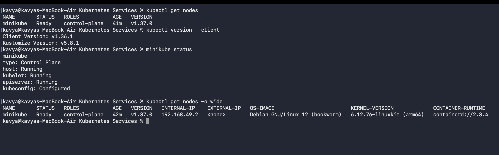
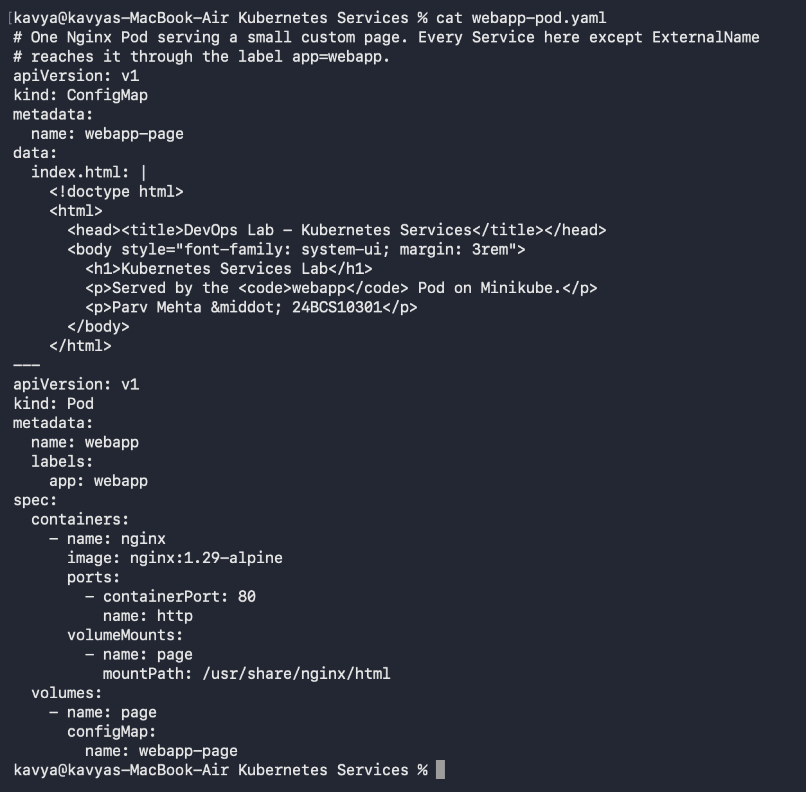
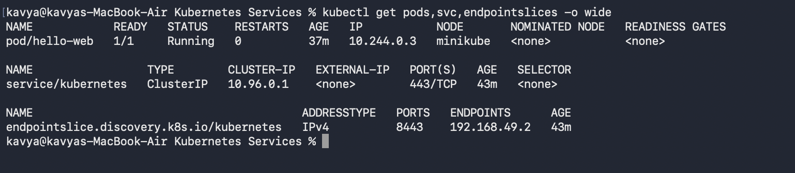
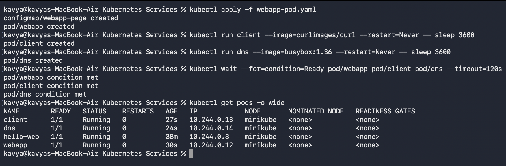
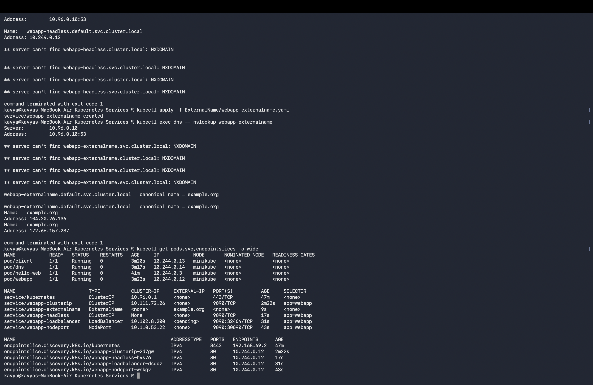
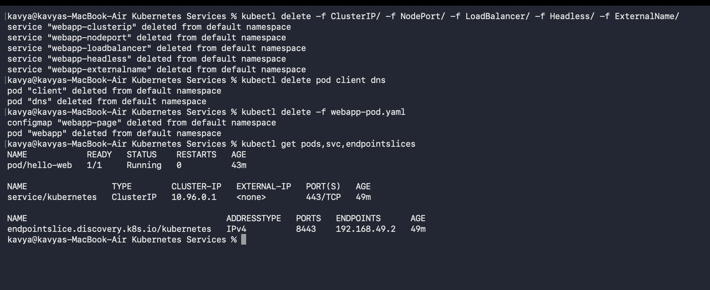

# Kubernetes Services

## Student Details

* **Name:** Kavya Raghavendran
* **Enrollment Number:** 24bcs10324

---

## Overview

In Kubernetes, Pods are ephemeral: their IP addresses dynamically change whenever they are created, updated, or rescheduled. A **Service** provides a durable abstraction layer—supplying a stable virtual IP address, DNS name, and load balancing across dynamic sets of Pods selected by labels.

This lab explores and validates all **five Kubernetes Service types** configured against a single target Nginx web application Pod (`app: webapp`).

**Environment:** Minikube with the Docker driver on macOS, Kubernetes v1.37.0, containerd 2.3.4 (Node internal IP: `192.168.49.2`).



---

## 1. The Target Web Application & Pod

Manifest: [`webapp-pod.yaml`](webapp-pod.yaml)

The workload consists of two resources:
1. A **ConfigMap** (`webapp-page`) providing custom HTML content.
2. A **Pod** (`webapp`) running `nginx:1.29-alpine` mounting the ConfigMap, labeled with `app: webapp`, and exposing named container port `http: 80`.

Using named ports (`targetPort: http`) decouples the Service definition from specific numeric container port numbers.



### Initial Cluster State & Deployment

Initial clean cluster state before applying workloads:



The application and testing helper Pods (`client` with `curlimages/curl` and `dns` with `busybox`) were launched and verified:

```bash
kubectl apply -f webapp-pod.yaml
kubectl run client --image=curlimages/curl --restart=Never -- sleep 3600
kubectl run dns --image=busybox:1.36 --restart=Never -- sleep 3600
kubectl wait --for=condition=Ready pod/webapp pod/client pod/dns --timeout=120s
kubectl get pods -o wide
```



---

## 2. Comparison of the Five Service Types

| Service Type | Directory | Service Name | Reachability & Scope | Verification Method |
|---|---|---|---|---|
| **ClusterIP** | [`ClusterIP/`](ClusterIP/) | `webapp-clusterip` | Internal to cluster only | `curl` from inside `client` Pod returned HTTP 200 via ClusterIP virtual IP (`10.111.72.26:9090`). |
| **NodePort** | [`NodePort/`](NodePort/) | `webapp-nodeport` | Accessible externally on `<NodeIP>:30090` | Allocates a static port (`30090`) on every cluster node, routing traffic into underlying ClusterIP. |
| **LoadBalancer** | [`LoadBalancer/`](LoadBalancer/) | `webapp-loadbalancer` | External Cloud Load Balancer | Provisions cloud load balancer (shows `<pending>` locally on Minikube while retaining active NodePort & ClusterIP). |
| **Headless** | [`Headless/`](Headless/) | `webapp-headless` (`clusterIP: None`) | Direct Pod IP via internal DNS | `nslookup` queries resolve directly to the backing Pod IP (`10.244.0.12`) without virtual IP proxying. |
| **ExternalName** | [`ExternalName/`](ExternalName/) | `webapp-externalname` | External DNS Alias | Returns a `CNAME` record redirecting internal queries out of the cluster to `example.org`. |

---

## 3. Architecture & Service Layer Relationship

```text
               +------------------------------------+
               |           LoadBalancer             |  (External Cloud VIP)
               +-----------------+------------------+
                                 |
               +-----------------v------------------+
               |             NodePort               |  (e.g., NodeIP:30090)
               +-----------------+------------------+
                                 |
               +-----------------v------------------+
               |            ClusterIP               |  (Internal Virtual IP)
               +-----------------+------------------+
                                 |  kube-proxy / EndpointSlice
               +-----------------v------------------+
               |        Target Pod (webapp)         |  (Pod IP: 10.244.0.12)
               +------------------------------------+
```

* **ClusterIP, NodePort, and LoadBalancer form a progressive stack:**
  * **ClusterIP** provides an internal VIP and kube-proxy iptables/IPVS routing.
  * **NodePort** builds on ClusterIP by opening a dedicated high-range port across all nodes.
  * **LoadBalancer** builds on NodePort by requesting an external public IP from a cloud provider.
* **Headless & ExternalName bypass kube-proxy entirely:**
  * **Headless (`clusterIP: None`)** bypasses virtual IP allocation and uses CoreDNS to return raw Pod IP addresses for direct peer-to-peer or stateful routing.
  * **ExternalName** configures a CNAME record in cluster CoreDNS to route internal traffic to external hostnames.

---

## 4. Final Verification State

All five Services active concurrently alongside their respective **EndpointSlices** and running Pods:

```bash
kubectl get pods,svc,endpointslices -o wide
```



* **EndpointSlice Discovery:** Selector-backed Services (`webapp-clusterip`, `webapp-nodeport`, `webapp-loadbalancer`, `webapp-headless`) each have corresponding `EndpointSlice` objects targeting `10.244.0.12:80`. `webapp-externalname` requires no EndpointSlice since it delegates to external DNS.

---

## 5. Cleanup

```bash
kubectl delete -f ClusterIP/ -f NodePort/ -f LoadBalancer/ -f Headless/ -f ExternalName/
kubectl delete pod client dns
kubectl delete -f webapp-pod.yaml
kubectl get pods,svc,endpointslices
```



---

## Service Summary Reference

| Command | Purpose |
|---|---|
| `kubectl get svc -o wide` | List all Services, assigned ClusterIPs, External IPs, and Port mappings |
| `kubectl get endpointslices` | Inspect discovered Pod IPs backing each active Service |
| `kubectl describe svc <name>` | Display detailed Service selectors, target ports, and endpoints |
| `kubectl exec <client-pod> -- curl -s http://<svc-name>:<port>` | Test internal Service name and virtual IP routing |
| `kubectl exec <dns-pod> -- nslookup <svc-name>` | Verify DNS resolution for Headless and ExternalName Services |
