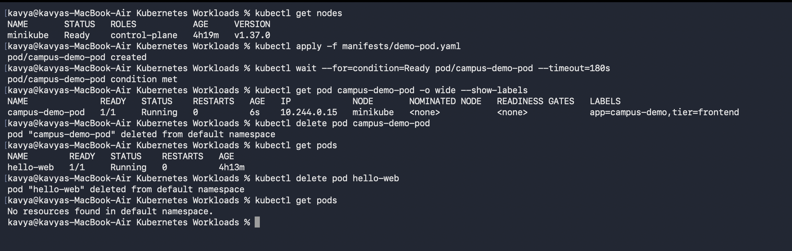
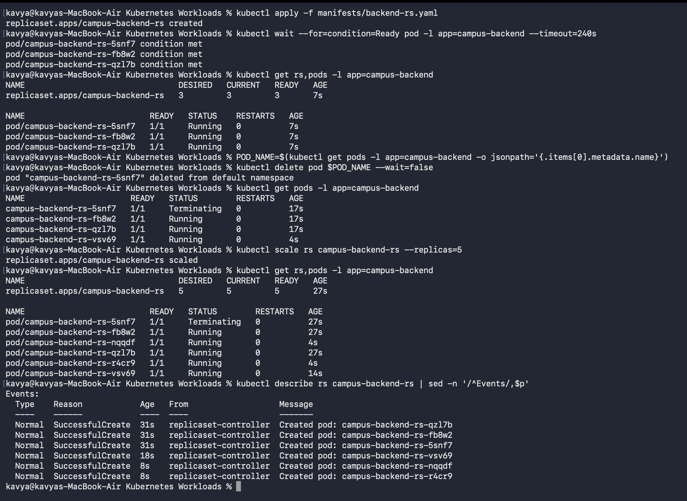
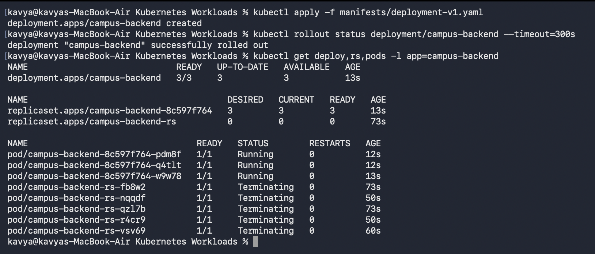
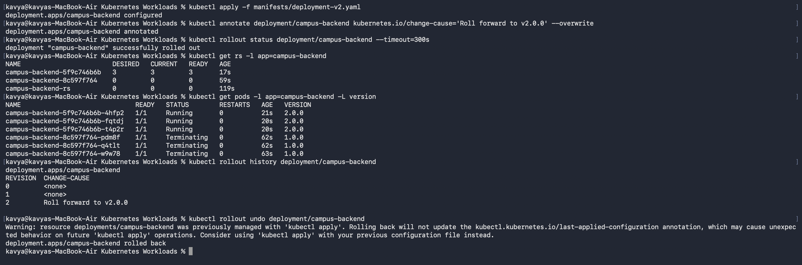
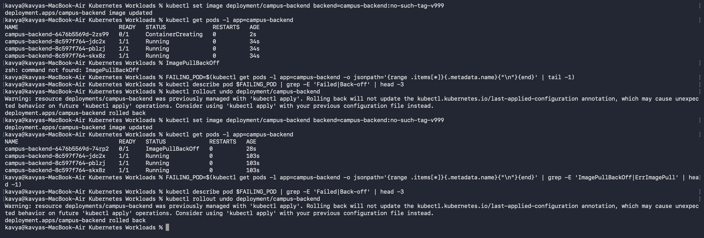
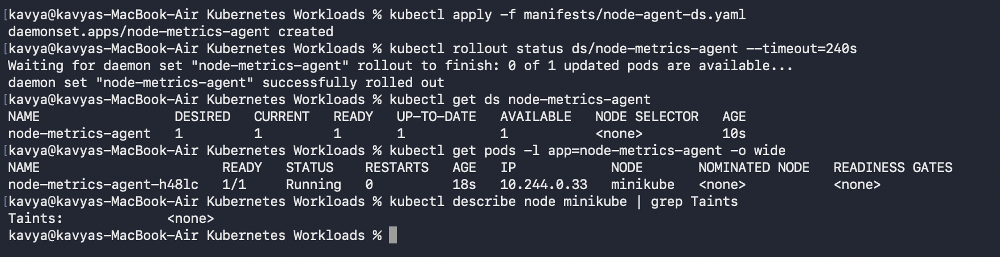

# Kubernetes Workloads

## Student Details

* **Name:** Kavya Raghavendran
* **Enrollment Number:** 2024bcs10324

---

## Overview

This lab walks through core Kubernetes workload controllers—**Pods**, **ReplicaSets**, **Deployments**, and **DaemonSets**—executed in sequence on a local Minikube cluster. Each controller builds upon the capabilities of the previous one to demonstrate self-healing, rolling updates, rollbacks, fault tolerance, and node-level scheduling.

| Workload Object | What it Adds |
|---|---|
| **Pod** | Smallest schedulable compute unit. Runs one or more containers sharing network namespace (IP) and storage volumes. Does **not** self-heal if terminated. |
| **ReplicaSet** | Maintains a declared number of identical Pod replicas matching a label selector. Provides automated self-healing and horizontal scaling. |
| **Deployment** | Declarative manager for ReplicaSets. Enables zero-downtime rolling updates, release history tracking, pause/resume, and instant rollbacks. |
| **DaemonSet** | Ensures an exact single instance of a Pod runs on every eligible node in the cluster (ideal for monitoring agents and log collectors). |

All Kubernetes manifests used in this lab are located in [`manifests/`](manifests).

---

## 1. Bare Pod Lifecycle & Lack of Self-Healing

Manifest: [`manifests/demo-pod.yaml`](manifests/demo-pod.yaml)

A standalone Pod was created and subsequently deleted:

```bash
kubectl apply -f manifests/demo-pod.yaml
kubectl wait --for=condition=Ready pod/campus-demo-pod --timeout=180s
kubectl get pod campus-demo-pod -o wide --show-labels
kubectl delete pod campus-demo-pod
kubectl get pods
```



* **Key Takeaway:** Deleting the bare Pod results in `No resources found in default namespace`. Because bare Pods lack an active controller loop, Kubernetes will not reschedule or revive them if deleted or crashed. In production, Pods are managed by higher-level controllers.

---

## 2. ReplicaSet — Self-Healing & Horizontal Scaling

Manifest: [`manifests/backend-rs.yaml`](manifests/backend-rs.yaml) (Configured for `replicas: 3` with selector `app=campus-backend`)

```bash
kubectl apply -f manifests/backend-rs.yaml
kubectl wait --for=condition=Ready pod -l app=campus-backend --timeout=240s
kubectl get rs,pods -l app=campus-backend

# Intentionally delete one pod to test auto-recovery
POD_NAME=$(kubectl get pods -l app=campus-backend -o jsonpath='{.items[0].metadata.name}')
kubectl delete pod $POD_NAME --wait=false
kubectl get pods -l app=campus-backend

# Scale up from 3 to 5 replicas
kubectl scale rs campus-backend-rs --replicas=5
kubectl describe rs campus-backend-rs | sed -n '/^Events/,$p'
```



* **Instant Self-Healing:** When a Pod is deleted, the ReplicaSet controller detects the count deficit and immediately spins up a replacement (`ContainerCreating`) while the old Pod is still `Terminating`.
* **Loose Coupling via Selectors:** The ReplicaSet discovers Pods strictly through label matching (`app: campus-backend`), allowing dynamic membership.
* **Limitation:** A ReplicaSet does not support rolling image updates; modifying the pod template does not affect existing running Pods.

---

## 3. Deployment — Rolling Updates & Rollback

Manifests: [`manifests/deployment-v1.yaml`](manifests/deployment-v1.yaml) $\rightarrow$ [`manifests/deployment-v2.yaml`](manifests/deployment-v2.yaml)

### Deployment Architecture & Hierarchy

Deploying v1 establishes the 3-tier hierarchy: **Deployment $\rightarrow$ ReplicaSet $\rightarrow$ Pods**:

```bash
kubectl apply -f manifests/deployment-v1.yaml
kubectl rollout status deployment/campus-backend --timeout=300s
kubectl get deploy,rs,pods -l app=campus-backend
```



### Zero-Downtime Rolling Update & Revision Rollback

Updating to v2 with revision change annotations, observing rollout progress, and rolling back:

```bash
kubectl apply -f manifests/deployment-v2.yaml
kubectl annotate deployment/campus-backend kubernetes.io/change-cause='Roll forward to v2.0.0' --overwrite
kubectl rollout status deployment/campus-backend --timeout=300s
kubectl get rs -l app=campus-backend
kubectl get pods -l app=campus-backend -L version

kubectl rollout history deployment/campus-backend
kubectl rollout undo deployment/campus-backend
```



* **Dual ReplicaSet Transition:** Applying v2 creates a new ReplicaSet (`5f9c746b6b`), progressively scaling it up while scaling the old ReplicaSet (`8c597f764`) down to 0 replicas.
* **Instant Rollback:** `kubectl rollout undo` immediately scales the inactive ReplicaSet (`8c597f764`) back up to 3 replicas without redownloading images.

---

## 4. Troubleshooting Rollouts & Fault Isolation

Simulating an update to a non-existent container image tag to inspect error states:

```bash
kubectl set image deployment/campus-backend backend=campus-backend:no-such-tag-v999
kubectl get pods -l app=campus-backend
FAILING_POD=$(kubectl get pods -l app=campus-backend -o jsonpath='{range .items[*]}{.metadata.name}{"\n"}{end}' | tail -1)
kubectl describe pod $FAILING_POD | grep -E 'Failed|Back-off' | head -3
kubectl rollout undo deployment/campus-backend
```



* **Zero Application Downtime on Failure:** While the invalid pod enters `ImagePullBackOff`, the existing 3 healthy pods remain active and continue serving traffic uninterrupted because `maxUnavailable: 0` prevents terminating healthy pods until new ones pass readiness.
* **Recovery:** Rolling back (`kubectl rollout undo`) cleans up the failed rollout attempt.

---

## 5. DaemonSet — Node-Level Workloads

Manifest: [`manifests/node-agent-ds.yaml`](manifests/node-agent-ds.yaml)

A DaemonSet runs exactly one Pod on each eligible node in the cluster without specifying replica counts.

```bash
kubectl apply -f manifests/node-agent-ds.yaml
kubectl rollout status ds/node-metrics-agent --timeout=240s
kubectl get ds node-metrics-agent
kubectl get pods -l app=node-metrics-agent -o wide
kubectl describe node minikube | grep Taints
```



* **Node Scheduling:** In single-node Minikube, `DESIRED` equals `1`. If new nodes join the cluster, the DaemonSet automatically schedules pods onto them.
* **Common Use Cases:** Log forwarders (Fluentd/Promtail), monitoring agents (Node Exporter/Datadog), and network plugins (Calico/Cilium).

---

## 6. Cleanup

```bash
kubectl delete ds node-metrics-agent
kubectl delete deployment campus-backend
```

---

## Pod Lifecycle & Status Quick Reference

| Pod Status | Definition | Diagnostic Step |
|---|---|---|
| `Pending` | Pod waiting to be scheduled on a node | Run `kubectl describe pod <name>` to check resource limits, taints, or PVC binds |
| `ContainerCreating` | Runtime pulling image / attaching volumes | Wait momentarily, then inspect `kubectl describe pod <name>` |
| `ImagePullBackOff` | Registry authentication failure or invalid image/tag | Check image repository URL, tag spelling, or image pull secrets |
| `CrashLoopBackOff` | Container repeatedly starts, crashes, and restarts | Check crash logs via `kubectl logs <name> --previous` |
| `Running (0/1 Ready)` | Container is alive but failing readiness probe | Verify readiness probe endpoint/port and application health |
| `Terminating` | Pod undergoing graceful termination | Check grace period (30s default) or finalizers |
