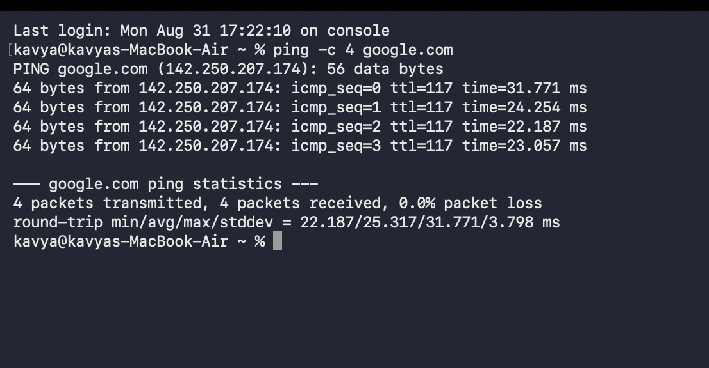
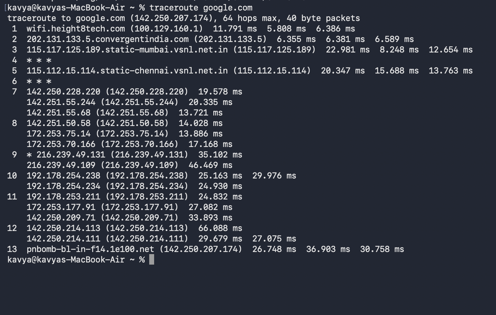
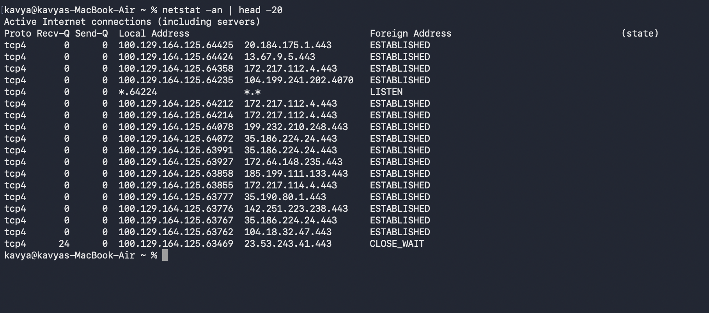
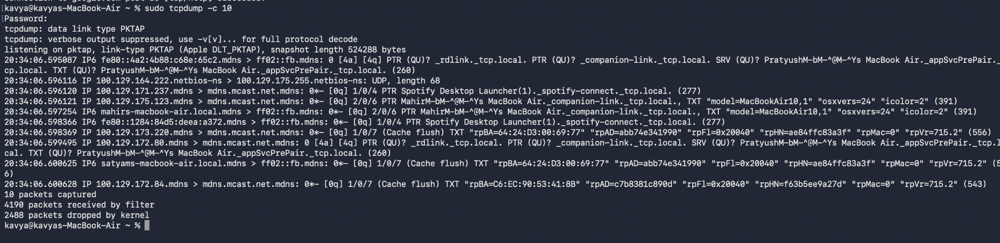
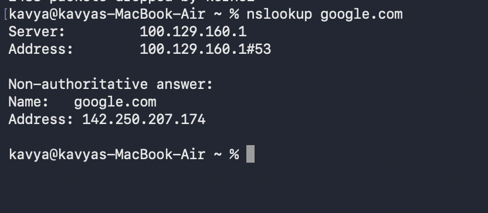
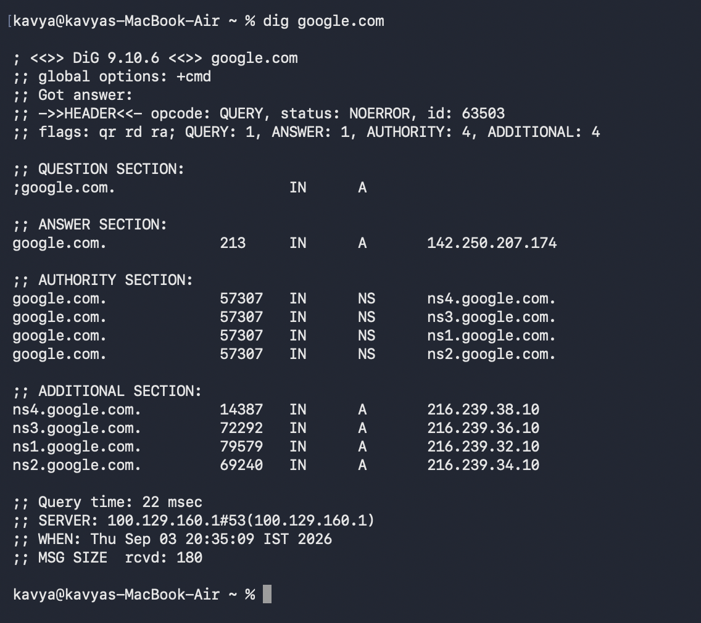
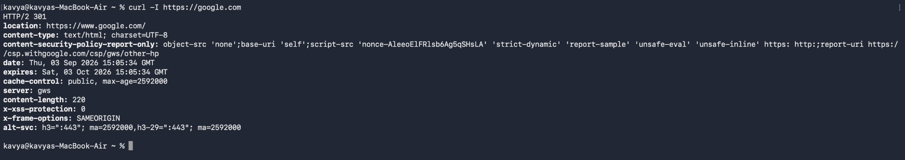
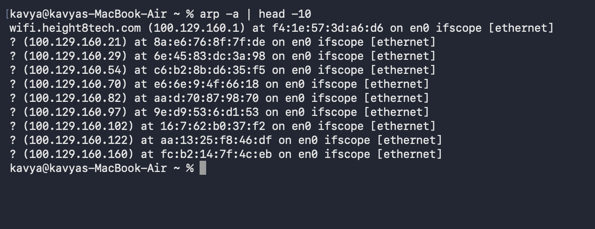
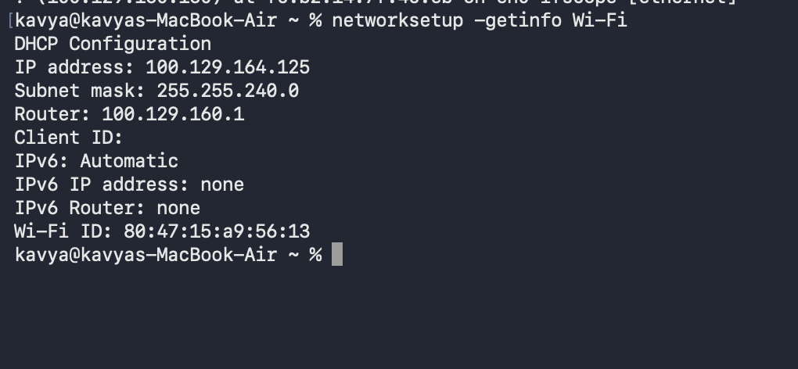

# Network Fundamentals

## 1. Ping

`ping` is used to test network connectivity between your system and a remote host. It sends ICMP (Internet Control Message Protocol) Echo Request packets and listens for Echo Reply packets to verify reachability and measure round-trip time (latency).

### Command
```bash
ping -c 4 google.com
```

### Output


---

## 2. Traceroute

`traceroute` tracks the route (hops) that packets take from your machine to a destination host across the network. It displays each router/gateway along the path and the round-trip time for each hop, which helps identify network bottlenecks or routing issues.

### Command
```bash
traceroute google.com
```

### Output


---

## 3. Netstat

`netstat` (network statistics) displays active network connections, routing tables, and interface statistics. The `-an` option lists all active sockets and network connections numerically without resolving hostnames or port names.

### Command
```bash
netstat -an | head -20
```

### Output


---

## 4. Telnet / Netcat

`nc` (Netcat) is a versatile networking utility used for reading from and writing to network connections over TCP or UDP. It is commonly used as a modern alternative to `telnet` to check port accessibility and test socket connectivity. The `-vz` flag runs in verbose mode and checks if the port is open without sending data.

### Command
```bash
nc -vz google.com 80
```

### Output


---

## 5. Tcpdump

`tcpdump` is a command-line packet analyzer and sniffer tool. It captures and inspects network packets in real-time on network interfaces. It requires administrative privileges (`sudo`), and `-c 10` limits the capture to 10 packets.

### Command
```bash
sudo tcpdump -c 10
```

### Output


---

## 6. Nslookup

`nslookup` (Name Server Lookup) is used to query DNS (Domain Name System) servers to resolve domain names to IP addresses or perform reverse DNS lookups.

### Command
```bash
nslookup google.com
```

### Output


---

## 7. Dig

`dig` (Domain Information Groper) is a powerful DNS lookup utility. It queries DNS name servers and returns detailed information about DNS records, query response times, and authoritative name servers.

### Command
```bash
dig google.com
```

### Output


---

## 8. Curl

`curl` (Client URL) is a command-line tool used to transfer data using various network protocols such as HTTP and HTTPS. The `-I` (or `--head`) option retrieves only the HTTP response headers, which is useful for checking server response status and headers.

### Command
```bash
curl -I https://google.com
```

### Output


---

## 9. ARP

`arp` (Address Resolution Protocol) displays and manages the local system's ARP cache, which maps IP addresses (Layer 3) to physical MAC addresses (Layer 2) on the local area network.

### Command
```bash
arp -a | head -10
```

### Output


---

## 10. Network Configuration — macOS Equivalent

On macOS, `networksetup` is a command-line utility used to view and configure network services and interfaces. The `-getinfo Wi-Fi` option retrieves configuration details such as IP address, subnet mask, router/gateway, and Wi-Fi interface settings.

### Command
```bash
networksetup -getinfo Wi-Fi
```

### Output

