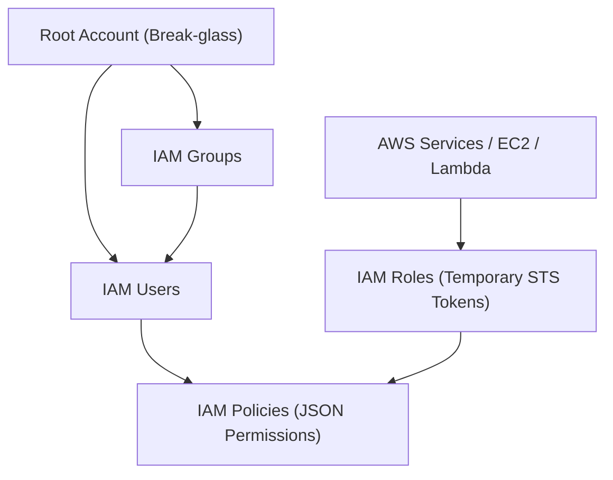

# AWS IAM (Identity and Access Management) — Governance

## Student Details

* **Name:** Kavya Raghavendran
* **Enrollment Number:** 24bcs10324

---

## 1. What is AWS IAM?

**AWS Identity and Access Management (IAM)** is a foundational cloud security and governance service that enables administrators to securely control authentication (who can sign in) and authorization (what permissions they have) across all AWS services and resources.

IAM is globally available, free of charge, and serves as the primary security barrier in any cloud architecture.

---

## 2. Core IAM Components



### 2.1 IAM Users
* Represents an individual human identity or interactive system needing long-term access to AWS.
* **Credentials:** Password (for AWS Management Console) and Access Key ID / Secret Access Key (for AWS CLI & SDKs).

### 2.2 IAM Groups
* A collection of IAM users.
* Used to attach permissions to multiple users simultaneously (e.g., `Developers`, `SecurityAdmins`, `DevOpsEngineers`).
* A group cannot contain other groups.

### 2.3 IAM Roles
* An identity with specific permission policies that is **not** associated with a specific individual.
* Instead of static access keys, roles provide **temporary security credentials** via AWS Security Token Service (STS).
* Used by:
  * AWS services (e.g. an EC2 instance or Lambda function reading from S3).
  * Cross-account access (allowing users in Account A to manage resources in Account B).
  * Federated identity providers (OIDC/SAML like Google, GitHub Actions, Okta).

### 2.4 IAM Policies
* Formal JSON documents that explicitly define permissions (**Allow** or **Deny**).
* Structure:
  ```json
  {
    "Version": "2012-10-17",
    "Statement": [
      {
        "Sid": "AllowS3ReadOnly",
        "Effect": "Allow",
        "Action": [
          "s3:GetObject",
          "s3:ListBucket"
        ],
        "Resource": [
          "arn:aws:s3:::company-app-assets",
          "arn:aws:s3:::company-app-assets/*"
        ]
      }
    ]
  }
  ```

---

## 3. Principle of Least Privilege (PoLP)

The **Principle of Least Privilege** requires that identities are granted only the minimum necessary permissions required to complete their assigned tasks, for the minimum required duration.

* **Explicit Deny overrides everything:** If a policy grants `s3:*` but another policy has `Deny` on `s3:DeleteObject`, deletion is blocked.
* **Default Deny:** If an action is not explicitly allowed, it is denied by default.

---

## 4. IAM Best Practices

1. **Lock Away the Root User:** Use the root account only for initial setup and emergency account-level changes. Enable hardware/virtual MFA immediately.
2. **Require Multi-Factor Authentication (MFA):** Enforce MFA on all human user accounts.
3. **Use Roles for Workloads & CI/CD:** Never hardcode long-lived AWS Access Keys in GitHub Actions or application servers; use OIDC and IAM Roles.
4. **Grant Permissions via Groups, Not Individual Users:** Assign policies to groups and add users to those groups.
5. **Rotate Credentials Regularly:** Regularly rotate console passwords and access keys, and deactivate unused credentials.
6. **Audit with IAM Access Advisor & CloudTrail:** Monitor when credentials were last used and remove redundant permissions.

---

## 5. Common Use Cases

* **CI/CD Pipeline Authentication:** GitHub Actions assuming an IAM Role via OpenID Connect (OIDC) to deploy infrastructure without storing static secrets.
* **Microservice Data Access:** Granting a Kubernetes Pod running on EKS an IAM role (via IRSA) to write to an Amazon DynamoDB table.
* **Corporate SSO:** Federating enterprise Active Directory / Okta users into AWS Console roles.
