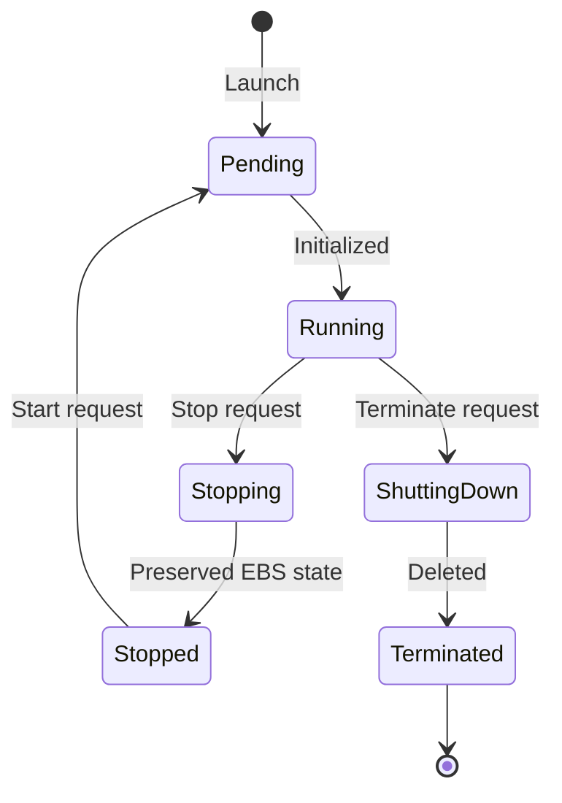

# AWS EC2 (Elastic Compute Cloud) — Compute

## Student Details

* **Name:** Kavya Raghavendran
* **Enrollment Number:** 24bcs10324

---

## 1. What is Amazon EC2?

**Amazon Elastic Compute Cloud (Amazon EC2)** provides scalable, on-demand virtual computing capacity in the AWS cloud. It eliminates the need to invest in physical hardware, allowing developers to launch and configure virtual servers (instances) within minutes.

---

## 2. Core EC2 Concepts

### 2.1 Amazon Machine Image (AMI)
* A pre-configured template containing the OS, application server, and pre-installed software required to launch an instance.
* Types: AWS Managed AMIs (Amazon Linux 2023, Ubuntu, Red Hat), Marketplace AMIs, and Custom User AMIs.

### 2.2 Instance Types
Instances are categorized into families optimized for different workloads:
* **General Purpose (`t4g`, `m6i`):** Balanced compute, memory, and networking (web servers, small databases).
* **Compute Optimized (`c7g`, `c6i`):** High-performance processors (batch processing, media transcoding, scientific modeling).
* **Memory Optimized (`r7g`, `r6i`):** Fast memory processing (in-memory caches like Redis, large enterprise databases).
* **Storage Optimized (`i4i`, `d3`):** High sequential read/write IOPS (data warehouses, distributed file systems).
* **Accelerated Computing (`g5`, `p4d`):** GPU instances for machine learning training and graphics rendering.

### 2.3 Key Pairs
* SSH public/private key pairs used for secure cryptographical authentication when connecting to Linux/Windows instances without passwords.
* The public key is embedded in the instance metadata; the private key (`.pem` file) is kept securely by the engineer.

### 2.4 Security Groups
* Virtual stateful firewalls operating at the instance elastic network interface (ENI) level.
* Controls inbound and outbound traffic using port, protocol, and CIDR/Security Group rules.
* **Stateful:** Return traffic for allowed inbound requests is automatically allowed outbound, regardless of outbound rules.

### 2.5 Amazon Elastic Block Store (EBS)
* Network-attached persistent block storage volumes attached to EC2 instances.
* Persists data independently of the instance lifecycle (can take point-in-time EBS Snapshots to S3).

---

## 3. Public vs Private IP Addressing

| Attribute | Public IP | Private IP | Elastic IP |
|---|---|---|---|
| **Routability** | Internet routable | Routable only within VPC & peered networks | Internet routable static IPv4 |
| **Persistence** | Released upon instance `Stop`/`Start` | Retained throughout instance life | Statically allocated and retained |
| **Cost** | Included with running instances | Free | Free when attached to a running instance |

---

## 4. EC2 Instance Lifecycle

* **Running:** Incurring hourly/per-second compute and EBS storage costs.
* **Stopped:** Compute is halted (no compute billing); EBS root volume state is preserved.
* **Terminated:** Instance and ephemeral storage are deleted permanently.

---

## 5. Common Use Cases

* **Application & Web Hosting:** Running web servers (Nginx, Apache, Node.js) behind an Application Load Balancer.
* **Kubernetes Nodes:** Self-managed Kubernetes worker nodes or Amazon EKS node groups.
* **CI/CD Self-Hosted Runners:** Running heavy build and test automation pipelines with dedicated resources.
