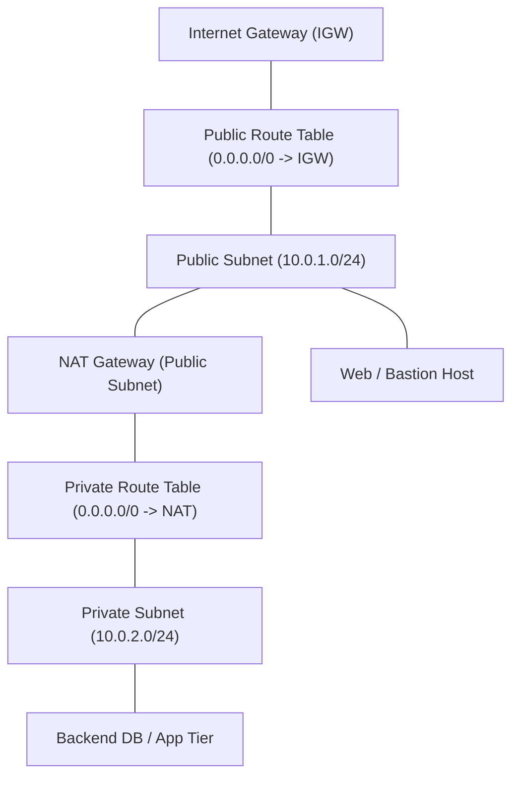

# AWS VPC (Virtual Private Cloud) — Networking

## Student Details

* **Name:** Kavya Raghavendran
* **Enrollment Number:** 24bcs10324

---

## 1. What is Amazon VPC?

**Amazon Virtual Private Cloud (Amazon VPC)** enables organizations to launch AWS resources into a logically isolated virtual software-defined network. It provides complete control over your virtual networking environment, including IP address range selection, subnet creation, and route table configuration.

---

## 2. Core VPC Components

### 2.1 CIDR Block (Classless Inter-Domain Routing)
* Defines the private IP range for the entire VPC (e.g. `10.0.0.0/16` providing 65,536 private IP addresses).
* Subnets divide this block into smaller segments (e.g. `10.0.1.0/24`).
* *Note:* AWS reserves 5 IP addresses in every subnet (Network, Router, DNS, Future use, Broadcast).

### 2.2 Subnets: Public vs Private
* **Public Subnet:** Associated with a route table that directs `0.0.0.0/0` internet traffic to an **Internet Gateway (IGW)**. Resources receive public IPs.
* **Private Subnet:** Not directly accessible from the internet. Traffic destined for the internet is routed through a **NAT Gateway** located in a public subnet.

### 2.3 Route Tables
* A set of routing rules that determine where network traffic from your subnet is directed (e.g. Local traffic within VPC, Internet via IGW/NAT, or Peering connections).

### 2.4 Internet Gateway (IGW) vs NAT Gateway
* **Internet Gateway (IGW):** Horizontally scaled, redundant VPC component that enables bidirectional communication between instances in public subnets and the internet.
* **NAT Gateway:** Network Address Translation service enabling instances in private subnets to initiate outbound connections to the internet (e.g. for OS updates/patches) while preventing unauthorized inbound connections from the internet.

---

## 3. Security: Security Groups vs Network ACLs (NACLs)

| Feature | Security Group (SG) | Network ACL (NACL) |
|---|---|---|
| **Level** | Instance / ENI level | Subnet level |
| **State** | **Stateful** (Inbound return traffic automatically allowed) | **Stateless** (Inbound and outbound rules evaluated separately) |
| **Rule Types** | **Allow rules only** | **Allow and Deny rules** (Evaluated in order by number) |
| **Default** | Deny all inbound, Allow all outbound | Default NACL allows all; Custom NACL denies all |

---

## 4. Common Use Cases

* **Multi-Tier Web Architecture:** Web tier deployed in public subnets behind a Load Balancer; backend microservices and databases securely isolated in private subnets.
* **Hybrid Cloud Connectivity:** Connecting on-premises data centers to AWS VPCs via AWS Site-to-Site VPN or AWS Direct Connect.
* **VPC Peering & Transit Gateway:** Connecting isolated VPCs across accounts and regions without traversing the public internet.
