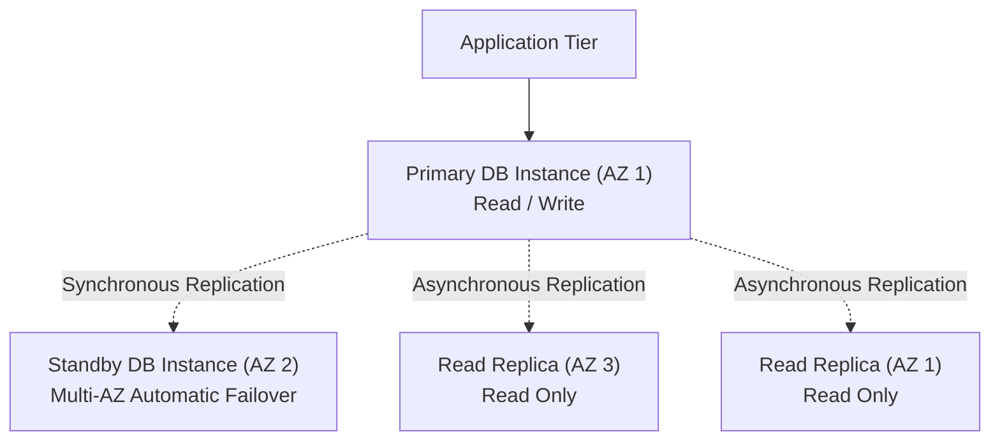

# AWS Database Services: Amazon DynamoDB & Amazon RDS

## Student Details

* **Name:** Kavya Raghavendran
* **Enrollment Number:** 24bcs10324

---

## 1. Overview of AWS Managed Database Services

AWS provides specialized database engines tailored for distinct workloads:
* **Amazon DynamoDB:** Fully managed, serverless, ultra-fast **NoSQL** document/key-value database.
* **Amazon RDS:** Fully managed **Relational Database Service** supporting standard SQL engines.

---

## 2. Amazon DynamoDB (NoSQL Service)

### 2.1 Core Concepts
* **Serverless & Scalable:** Automatically scales throughput and storage to handle trillions of requests daily with single-digit millisecond latency.
* **Tables:** Collection of data items (equivalent to a table in SQL).
* **Items:** A single record within a table (equivalent to a row). Each item can have distinct attributes (schema-less).
* **Attributes:** Fundamental data element (equivalent to a column or field).

### 2.2 Primary Keys
* **Partition Key (Single Key):** A unique attribute used by DynamoDB's internal hash function to distribute data evenly across physical storage partitions.
* **Composite Primary Key (Partition Key + Sort Key):** The Partition Key determines physical partition placement; the Sort Key orders items within that partition (enabling 1-to-many queries).

### 2.3 DynamoDB Use Cases
* High-throughput mobile/gaming backends (leaderboards, user sessions, shopping carts).
* IoT telemetry data ingestion and event logging.
* Real-time real-world microservices requiring microsecond read/write latencies.

---

## 3. Amazon RDS (Relational Database Service)

### 3.1 Supported SQL Engines
* **Amazon Aurora** (MySQL & PostgreSQL compatible, high performance enterprise cloud-native engine)
* **PostgreSQL**
* **MySQL**
* **MariaDB**
* **Oracle Database**
* **Microsoft SQL Server**

### 3.2 Key RDS Architecture Features

* **Multi-AZ Deployments:** Synchronous replication to a standby instance in a different Availability Zone for high availability and automatic failover.
* **Read Replicas:** Up to 15 asynchronous read-only instances to offload read-heavy reporting queries and scale read throughput.
* **Automated Backups & Snapshots:** Point-in-time recovery (PITR) with transaction logs allowing restoration to any second within retention window (up to 35 days).
* **Security:** Database encryption at rest via AWS KMS, SSL/TLS in transit, and network isolation inside private VPC DB subnet groups.

### 3.3 RDS Use Cases
* Enterprise transactional (OLTP) applications requiring strict ACID compliance.
* E-commerce inventory and order processing systems.
* Complex reporting applications requiring SQL joins, foreign keys, and complex transactions.

---

## 4. Comparison Summary: DynamoDB vs RDS

| Feature | Amazon DynamoDB | Amazon RDS |
|---|---|---|
| **Data Model** | NoSQL (Key-Value / Document) | Relational (SQL Tables / Rows / Columns) |
| **Schema** | Schema-less (Dynamic attributes) | Strict fixed relational schema |
| **Scaling** | Horizontal auto-scaling (Serverless) | Vertical instance scaling & Horizontal Read Replicas |
| **Latency** | Single-digit millisecond | Single-digit millisecond to second (query complexity dependent) |
| **High Availability** | Built-in multi-region / multi-AZ | Configured via Multi-AZ failover |
| **Best For** | High-scale, key-value lookups, sessions | Complex joins, relational transactions, ACID |
