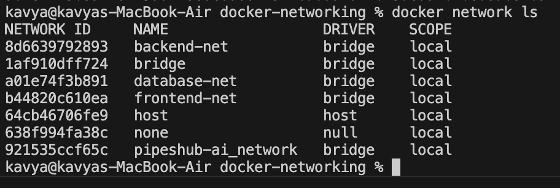
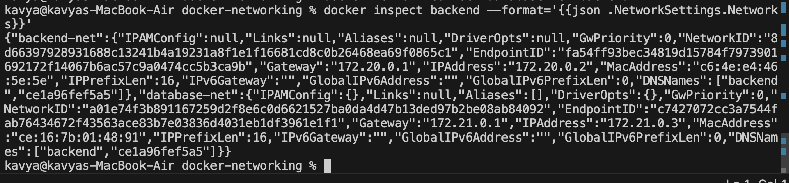
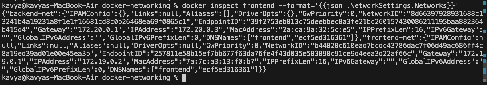
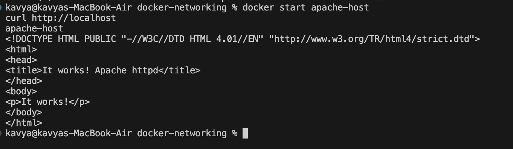

# Docker Networking & Volume

## Student Details

* **Name:** Kavya Raghavendran
* **Enrollment Number:** 2024bcs10324

---

## Task 1: Docker Container Networking & Isolation

In this task, a multi-tier container network architecture was created to demonstrate network segmentation, inter-container communication, and security isolation.

### 1. Network Creation

Three custom bridge networks were created:

```bash
docker network create frontend-net
docker network create backend-net
docker network create database-net
```

The created networks were verified using `docker network ls`:



### 2. Multi-Network Container Attachment

Containers were created and connected across the isolated networks:
* **Frontend:** Connected to `frontend-net` and `backend-net`.
* **Backend:** Connected to `backend-net` and `database-net`.
* **Database:** Connected to `database-net`.

The multi-network attachments were configured using:

```bash
docker network connect backend-net frontend
docker network connect database-net backend
```

### 3. Verification & Network Inspection

The network configurations were verified by inspecting container network settings:

* **Backend container attached to `backend-net` and `database-net`:**
  ```bash
  docker inspect backend --format='{{json .NetworkSettings.Networks}}'
  ```
  

* **Frontend container attached to `backend-net` and `frontend-net`:**
  ```bash
  docker inspect frontend --format='{{json .NetworkSettings.Networks}}'
  ```
  

### 4. Container Connectivity & Isolation Logic

* **Frontend to Backend:** Allowed via shared `backend-net`.
* **Backend to Database:** Allowed via shared `database-net`.
* **Frontend to Database:** Blocked and isolated because they do not share a common network. This enforces a secure multi-tier architectural boundary.

---

## Task 2: Host Network Driver

The `host` network driver removes network isolation between the container and the Docker host, allowing the container to use the host's networking stack directly.

### 1. Run Apache on Host Network

The official Apache `httpd` image was run with `--network host`:

```bash
docker run -d --name apache-host --network host httpd
```

### 2. Verification

Because the container shares the host network namespace, port mapping (`-p`) is not required. The Apache web server was verified directly on port 80:

```bash
curl http://localhost
```

The server responded successfully with `<h1>It works!</h1>`.



---

## Task 3: Bind Mounts & Live Updates

A bind mount was used to mount a directory from the local host filesystem into an Nginx container.

### 1. Directory Setup & Container Execution

A local folder `bind-mount/` was created with an `index.html` containing:

```html
Hello students
```

The directory was mounted into the Nginx container's document root:

```bash
docker run -d -p 8085:80 --name nginx-bind -v $(pwd)/bind-mount:/usr/share/nginx/html nginx
```

### 2. Initial Browser Verification

The application was accessed at `http://localhost:8085`, displaying "Hello students":


### 3. File Update & Live Reload Verification

The local `bind-mount/index.html` file was updated directly on the host machine to:

```html
Hello students - Updated
```

Refreshing `http://localhost:8085` reflected the changes immediately without restarting or rebuilding the container:


---

## Task 4: Docker Overlay Network (Research & Architecture)

### 1. What is an Overlay Network?
An **overlay network** is a distributed software-defined network driver in Docker that enables containers running on different physical or virtual Docker hosts to communicate securely and directly with each other without relying on host-level operating system routing.

### 2. Why is it Used?
* **Multi-Host Communication:** Allows microservices distributed across different nodes in a cluster to communicate seamlessly as if they were on the same local network.
* **Service Discovery & Load Balancing:** Automatically handles DNS-based service discovery and VIP-based load balancing across service tasks.
* **Security & Isolation:** Encapsulates traffic between containers and supports optional end-to-end data plane encryption using IPSec.

### 3. How it Works Across Multiple Hosts
Overlay networking utilizes **VXLAN (Virtual Extensible LAN)** tunneling (UDP port 4789). It encapsulates Layer 2 Ethernet frames within Layer 4 UDP packets transmitted over the underlying physical (underlay) network between Docker daemon hosts.

```text
+-------------------+                      +-------------------+
|     Host 1        |                      |     Host 2        |
|  +-------------+  |                      |  +-------------+  |
|  | Container A |  |                      |  | Container B |  |
|  +------+------+  |                      |  +------+------+  |
|         |         |                      |         |         |
|   [Overlay Net]   |<=== VXLAN Tunnel ===>|   [Overlay Net]   |
+-------------------+      (UDP 4789)      +-------------------+
```

### 4. Relationship with Docker Swarm
Overlay networks are natively integrated with **Docker Swarm**:
* Initializing or joining a Swarm cluster (`docker swarm init` / `docker swarm join`) enables the creation of swarm-scoped overlay networks:
  ```bash
  docker network create -d overlay --attachable my-overlay-net
  ```
* Docker Swarm automatically routes traffic to healthy containers across the swarm nodes using the ingress routing mesh.

### 5. Example Use Case
In a multi-host microservices deployment, a web frontend running on Worker Node 1 can send requests directly to an API service running on Worker Node 2 using service names (`http://api-service:5000`) across a private overlay network, keeping internal cluster communication hidden from external traffic.

### 6. Official References
* [Docker Overlay Network Driver Documentation](https://docs.docker.com/engine/network/drivers/overlay/)
* [Docker Swarm Networking Overview](https://docs.docker.com/engine/swarm/networking/)

---

## Conclusion

This homework covered key Docker networking and storage primitives:
1. **Custom Bridge Networks:** Enabled fine-grained communication and multi-tier isolation between frontend, backend, and database tiers.
2. **Host Network Driver:** Bypassed network virtualization for direct host port access.
3. **Bind Mounts:** Enabled live host-to-container filesystem synchronization for hot-reloading.
4. **Overlay Networks:** Explored multi-host container communication and clustering architectures in Docker Swarm.
