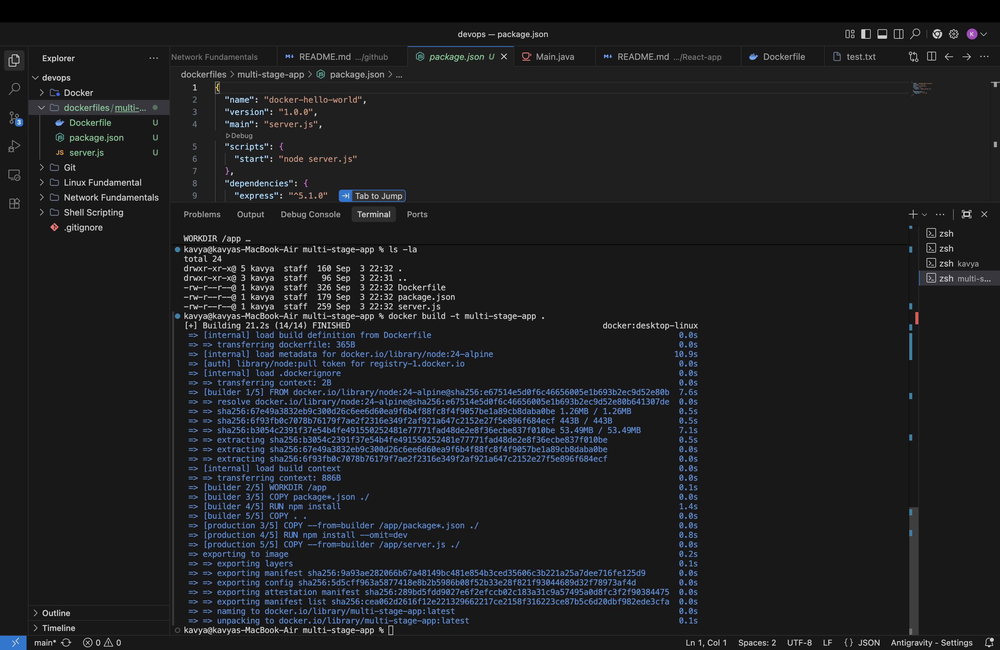
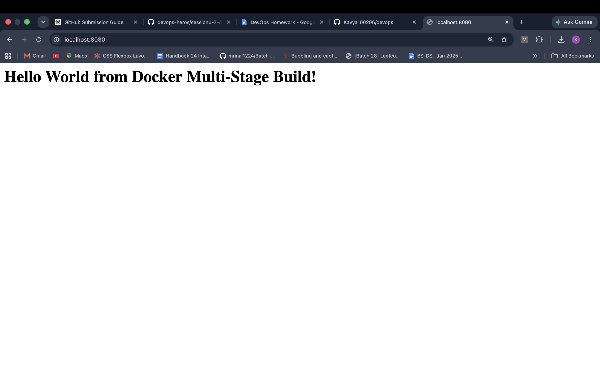
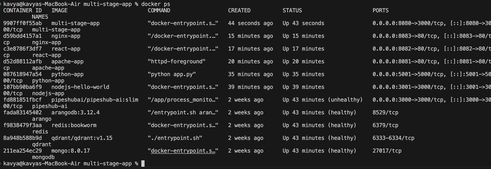

# Docker Multi-Stage Build

## Student Details

* **Name:** Kavya Raghavendran
* **Enrollment Number:** 2024bcs10324

---

## Task 1: Multi-Stage Dockerfile Implementation

A multi-stage Dockerfile was created for a Node.js Express application to optimize the final image size by separating build dependencies from the production runtime.

### 1. Dockerfile Architecture

The Dockerfile uses two stages:
* **Stage 1 (`builder`):** Installs dependencies and prepares the application source code.
* **Stage 2 (`production`):** Copies only production dependencies and source files into a minimal runtime image.

### 2. Build the Docker Image

The Docker image was built using:

```bash
docker build -t multi-stage-app .
```



### 3. Run the Container

The container was run in detached mode, mapping host port `8080` to container port `3000`:

```bash
docker run -d -p 8080:3000 --name multi-stage-app multi-stage-app
```

### 4. Verify in Browser

The application was accessed at `http://localhost:8080`, displaying:

```text
Hello World from Docker Multi-Stage Build!
```



### 5. Verify Running Container

The running container and port mappings were verified using:

```bash
docker ps
```

The output confirms `multi-stage-app` is actively running with port mapping `0.0.0.0:8080->3000/tcp`.



---

## Task 2: Documentation

This README documents the build process, execution commands, and verification evidence for the Docker multi-stage application homework.

---

## Task 3: Docker Application Deployments

In addition to the multi-stage application, containerized applications were created and deployed across multiple runtime environments under the `Docker/` directory:

* **Node.js (`Docker/nodejs-app/`):** Express web application containerized with Node.js.
* **Python (`Docker/python-app/`):** Containerized Python web service.
* **Java (`Docker/java-app/`):** Containerized Java HTTP application compiled and run using `eclipse-temurin:17-jdk`.

Each service features its own dedicated `Dockerfile`, configuration, and host port mapping.

---

## Conclusion

The multi-stage build pattern was successfully demonstrated with Node.js, ensuring a lightweight and secure production artifact. The container was deployed and verified via browser access at `http://localhost:8080` and container status inspection via `docker ps`.