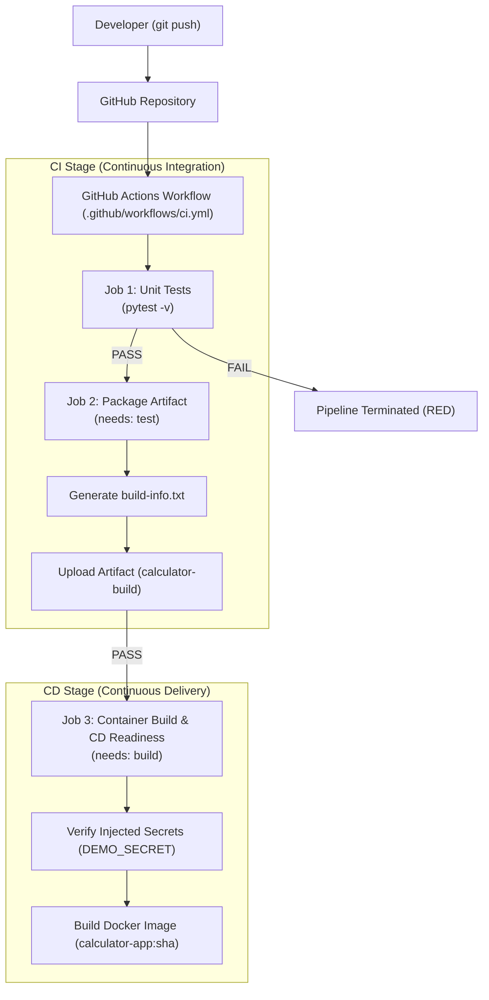

# Session 16: CI/CD & GitHub Actions

## Student Details

* **Name:** Kavya Raghavendran
* **Enrollment Number:** 24bcs10324

---

## Overview

This project demonstrates an end-to-end **Continuous Integration and Continuous Delivery (CI/CD)** pipeline built with **GitHub Actions**. It packages a Python Calculator microservice with automated unit testing, build artifact generation, GitHub Secrets security checks, and container image generation via Docker.



---

## Topics & Deliverables Covered

* **CI vs CD:** Understanding the separation between automated integration/testing (CI) and automated packaging/containerization (CD).
* **GitHub Actions Architecture:** Workflows, Jobs, Steps, Runners (`ubuntu-latest`), and Actions (`actions/checkout@v4`, `actions/setup-python@v5`, `actions/upload-artifact@v4`).
* **Multi-Job Dependency Orchestration:** Using `needs: test` and `needs: build` to enforce quality gates.
* **Secrets Management:** Safe secret injection via `${{ secrets.DEMO_SECRET }}` without leaking credentials in logs.
* **Artifact Management:** Archiving and sharing build bundles across runs.
* **Containerization:** Production `Dockerfile` building a minimal container image.
* **Test-Driven Fault Isolation:** Demonstrating automated pipeline failure on regressions.

---

## Deliverables & Directory Structure

```text
session16-cicd-github-actions/
│
├── .github/
│   └── workflows/
│       └── ci.yml             # Full CI/CD Multi-Job Workflow
│
├── app/
│   ├── __init__.py
│   └── calculator.py          # Application source code (add, sub, mul, div, power)
│
├── tests/
│   └── test_calculator.py     # Unit test suite with pytest
│
├── Dockerfile                 # Container image specification
├── requirements.txt           # Python dependencies (pytest)
├── build.sh                   # Build packaging script
├── .gitignore                 # Ignored directories
└── README.md                  # Comprehensive documentation
```

---

## 1. Application Source Code

[`app/calculator.py`](app/calculator.py) implements the arithmetic operations:

```python
def add(a, b):
    return a + b

def subtract(a, b):
    return a - b

def multiply(a, b):
    return a * b

def divide(a, b):
    if b == 0:
        raise ValueError("Cannot divide by zero")
    return a / b

def power(a, b):
    return a ** b
```

### Running Locally

```bash
python3 app/calculator.py
```

```text
Calculator Application
----------------------
Available operations: +, -, *, /, **
Type 'q' or 'quit' to exit.

Enter calculation (e.g., 10 + 5): 10 + 5
Result: 15.0

Enter calculation (e.g., 10 + 5): 2 ** 3
Result: 8.0

Enter calculation (e.g., 10 + 5): q
Goodbye!
```

---

## 2. Unit Testing (`pytest`)

[`tests/test_calculator.py`](tests/test_calculator.py) verifies all core operations and edge cases:

```bash
python3 -m pip install -r requirements.txt
python3 -m pytest -v
```

```text
============================= test session starts ==============================
collected 6 items

tests/test_calculator.py::test_add PASSED                                [ 16%]
tests/test_calculator.py::test_subtract PASSED                           [ 33%]
tests/test_calculator.py::test_multiply PASSED                           [ 50%]
tests/test_calculator.py::test_divide PASSED                             [ 66%]
tests/test_calculator.py::test_divide_by_zero PASSED                     [ 83%]
tests/test_calculator.py::test_power PASSED                              [100%]

============================== 6 passed in 0.01s ===============================
```

---

## 3. Containerization (`Dockerfile`)

[`Dockerfile`](Dockerfile) builds a lightweight container runtime for the application:

```dockerfile
FROM python:3.12-slim

WORKDIR /app

COPY requirements.txt .
RUN pip install --no-cache-dir -r requirements.txt

COPY app/ ./app/
COPY tests/ ./tests/
COPY build.sh .

CMD ["python", "app/calculator.py"]
```

---

## 4. GitHub Actions CI/CD Pipeline

Defined in [`.github/workflows/ci.yml`](.github/workflows/ci.yml):

```yaml
name: Python CI/CD Pipeline

on:
  push:
    branches:
      - main
  pull_request:
    branches:
      - main
  workflow_dispatch:

jobs:
  # --- CI STAGE: Unit Testing ---
  test:
    name: Run Unit Tests (CI)
    runs-on: ubuntu-latest
    steps:
      - name: Checkout source code
        uses: actions/checkout@v4

      - name: Setup Python
        uses: actions/setup-python@v5
        with:
          python-version: "3.12"

      - name: Install dependencies
        run: |
          python -m pip install --upgrade pip
          pip install -r requirements.txt

      - name: Run test suite
        run: |
          pytest -v

  # --- CI STAGE: Packaging & Artifacts ---
  build:
    name: Build & Package Artifact (CI)
    needs: test
    runs-on: ubuntu-latest
    steps:
      - name: Checkout source code
        uses: actions/checkout@v4

      - name: Setup Python
        uses: actions/setup-python@v5
        with:
          python-version: "3.12"

      - name: Build application
        run: |
          chmod +x build.sh
          ./build.sh

      - name: Upload build artifact
        uses: actions/upload-artifact@v4
        with:
          name: calculator-build
          path: build/

  # --- CD STAGE: Container Packaging & Secrets ---
  deploy-preparation:
    name: Container Build & CD Readiness
    needs: build
    runs-on: ubuntu-latest
    steps:
      - name: Checkout source code
        uses: actions/checkout@v4

      - name: Verify Repository Secrets
        env:
          DEMO_SECRET: ${{ secrets.DEMO_SECRET }}
        run: |
          if [ -n "$DEMO_SECRET" ]; then
            echo "DEMO_SECRET is configured and securely injected."
          else
            echo "DEMO_SECRET is not configured (optional classroom secret)."
          fi

      - name: Build Docker Container Image (CD Packaging)
        run: |
          docker build -t calculator-app:${{ github.sha }} .
          docker images | grep calculator-app
```

---

## 5. CI vs CD & Security Concepts

### Comparison

| Concept | Continuous Integration (CI) | Continuous Delivery (CD) |
|---|---|---|
| **Primary Scope** | Code validation, linting, unit testing | Packaging, containerization, staging/production releases |
| **Pipeline Jobs** | `test` (pytest), `build` (packaging) | `deploy-preparation` (Docker image build, secret injection) |
| **Gating Gate** | If tests fail $\rightarrow$ pipeline stops immediately | Runs only after CI stages succeed (`needs: build`) |

### Secrets Management in GitHub Actions

* Configured under **Repository Settings $\rightarrow$ Secrets and variables $\rightarrow$ Actions $\rightarrow$ New repository secret**.
* Injected into steps using `${{ secrets.SECRET_NAME }}`.
* GitHub Actions automatically masks secrets in execution logs to prevent leakage.

---

## 6. Fault Simulation & Recovery Walkthrough

### Intentionally Introducing a Regression

1. Modify `app/calculator.py`:
   ```python
   def add(a, b):
       return a + b + 1
   ```
2. Push the commit to trigger the pipeline.
3. **Outcome:**
   * `Run Unit Tests (CI)` $\rightarrow$ ❌ **FAILED**
   * `Build & Package Artifact (CI)` $\rightarrow$ ⛔ **CANCELLED**
   * `Container Build & CD Readiness` $\rightarrow$ ⛔ **CANCELLED**

### Resolving the Issue

1. Restore the correct logic:
   ```python
   def add(a, b):
       return a + b
   ```
2. Push to GitHub $\rightarrow$ All jobs pass with green checks ✅.
