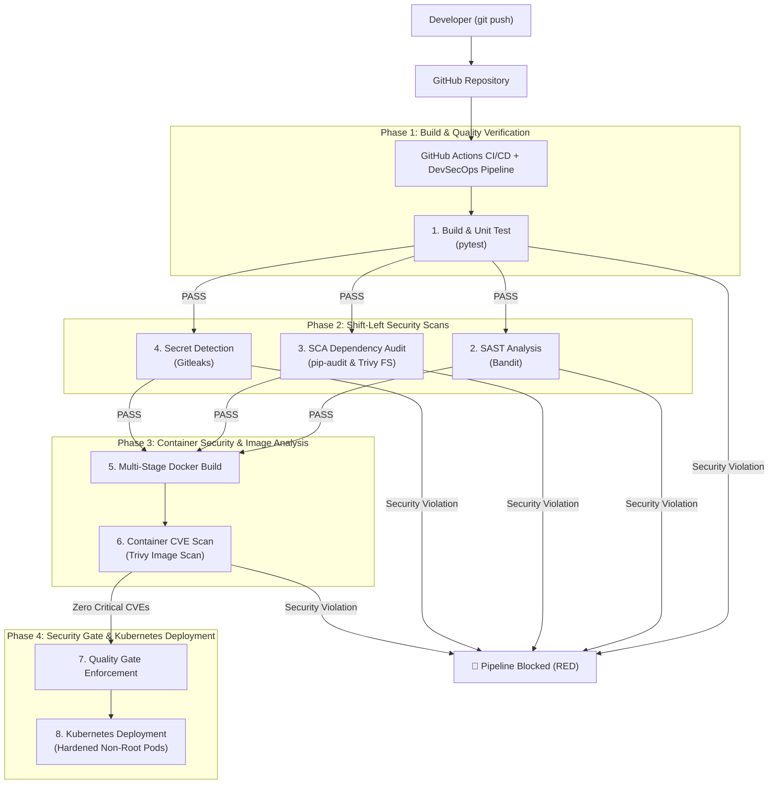

# Session 17: Complete CI/CD & DevSecOps Pipeline

## Student Details

* **Name:** Kavya Raghavendran
* **Enrollment Number:** 24bcs10324

---

## Overview

This project implements an enterprise-grade **DevSecOps** pipeline using **GitHub Actions**. By integrating security testing at every stage of the software development lifecycle (Shift-Left Security), the pipeline ensures vulnerabilities, outdated dependencies, hardcoded secrets, and container weaknesses are detected and blocked before reaching production Kubernetes clusters.



---

## Topics & Security Pillars Covered

| Security Pillar | Tool / Technology | Purpose | Stage |
|---|---|---|---|
| **SAST** (Static Application Security Testing) | `Bandit` | Scans raw Python source code for security flaws (e.g. injection, weak crypto, unsafe bindings) | Code / Pre-Build |
| **SCA** (Software Composition Analysis) | `pip-audit`, `Trivy` | Identifies known CVEs and insecure third-party dependencies in `requirements.txt` | Build |
| **Secret Scanning** | `Gitleaks` | Detects accidentally committed API keys, tokens, credentials, and private keys in Git history | Commit |
| **Container Scanning** | `Trivy` | Scans container OS layers and runtime libraries for vulnerabilities | Package |
| **Hardened Runtime** | Multi-stage Docker, Non-Root (`10001:10001`) | Minimizes container attack surface and prevents privilege escalation | Container |
| **Kubernetes Security** | `securityContext`, `readOnlyRootFilesystem`, `drop: [ALL]` | Enforces least-privilege runtime security inside Kubernetes Pods | Deployment |

---

## Project Structure

```text
session17-devsecops-pipeline/
│
├── .github/
│   └── workflows/
│       └── devsecops.yml       # Complete Multi-Stage DevSecOps Pipeline
│
├── app/
│   ├── __init__.py
│   └── main.py                # Hardened Python Flask REST Microservice
│
├── tests/
│   └── test_main.py           # Pytest unit & health check test suite
│
├── security-configs/
│   ├── bandit.yaml            # SAST scanner rules and exclusions
│   ├── gitleaks.toml          # Secret detection allowlists and regexes
│   └── trivy.yaml             # Vulnerability scan threshold & gate policy
│
├── k8s/
│   ├── configmap.yaml         # Environment and logging config
│   ├── deployment.yaml        # Hardened non-root deployment with probes
│   └── service.yaml           # ClusterIP internal service routing
│
├── Dockerfile                 # Multi-stage non-root container definition
├── requirements.txt           # Application dependencies
└── README.md                  # Comprehensive session documentation
```

---

## 1. Application Implementation

[`app/main.py`](app/main.py) implements a clean, sanitized REST API:

```python
from flask import Flask, jsonify, request
import os

app = Flask(__name__)

@app.route("/", methods=["GET"])
def home():
    return jsonify({
        "service": "DevSecOps Secure Microservice",
        "status": "healthy",
        "student": "Kavya Raghavendran",
        "roll_number": "24bcs10324",
        "environment": os.getenv("APP_ENV", "production")
    })

@app.route("/healthz", methods=["GET"])
def health():
    return jsonify({"status": "UP", "checks": {"database": "OK", "cache": "OK"}}), 200

@app.route("/api/v1/data", methods=["GET", "POST"])
def data_endpoint():
    if request.method == "POST":
        payload = request.get_json(silent=True) or {}
        sanitized_input = str(payload.get("input", "")).strip()[:100]
        return jsonify({"message": "Data processed securely", "received": sanitized_input}), 201
    return jsonify({"message": "Secure data endpoint active"}), 200
```

---

## 2. Local Testing & Shift-Left Security Scans

### 2.1 Unit Testing (`pytest`)

```bash
python3 -m pytest -v
```

```text
============================= test session starts ==============================
collected 3 items

tests/test_main.py::test_home_endpoint PASSED                            [ 33%]
tests/test_main.py::test_health_check PASSED                             [ 66%]
tests/test_main.py::test_data_post_endpoint PASSED                       [100%]

============================== 3 passed in 0.06s ===============================
```

### 2.2 SAST Scan (`Bandit`)

```bash
bandit -r app/ -c security-configs/bandit.yaml -v
```

```text
Run started: 2026-10-07
Files in scope: app/main.py, app/__init__.py
Test results:
    No issues identified.
Code scanned: 26 lines
Total issues: 0 (High: 0, Medium: 0, Low: 0)
```

### 2.3 Secret Detection (`Gitleaks`)

```bash
gitleaks detect --source . --config security-configs/gitleaks.toml --verbose
```

* Scans git commits and files for regex matches indicating exposed tokens, AWS credentials, or passwords.

---

## 3. Container Hardening & Multi-Stage Dockerfile

[`Dockerfile`](Dockerfile) uses multi-stage builds and drops root privileges:

```dockerfile
# Stage 1: Build & Dependencies
FROM python:3.12-slim AS builder
WORKDIR /app
COPY requirements.txt .
RUN pip install --no-cache-dir --user -r requirements.txt

# Stage 2: Hardened Runtime
FROM python:3.12-slim AS runner
RUN groupadd -r appgroup && useradd -r -g appgroup -u 10001 appuser
WORKDIR /app
COPY --from=builder /root/.local /home/appuser/.local
ENV PATH=/home/appuser/.local/bin:$PATH
COPY app/ ./app/
RUN chown -R appuser:appgroup /app

USER 10001:10001
EXPOSE 5000
CMD ["gunicorn", "--bind", "0.0.0.0:5000", "--workers", "2", "app.main:app"]
```

---

## 4. Hardened Kubernetes Manifests

[`k8s/deployment.yaml`](k8s/deployment.yaml) implements Kubernetes Pod Security Standards:

* **`runAsNonRoot: true`**: Pod cannot run as UID 0 (root).
* **`allowPrivilegeEscalation: false`**: Disables `setuid` binaries from gaining elevated privileges.
* **`capabilities.drop: ["ALL"]`**: Strips all Linux kernel capabilities from container processes.
* **Health Probes**: `livenessProbe` and `readinessProbe` monitoring `/healthz`.

---

## 5. GitHub Actions DevSecOps Workflow

The complete pipeline is codified in [`.github/workflows/devsecops.yml`](.github/workflows/devsecops.yml):

```yaml
name: Complete DevSecOps CI/CD Pipeline

on:
  push:
    branches: [ main ]
  pull_request:
    branches: [ main ]
  workflow_dispatch:

jobs:
  build-and-test:
    name: 1. Build & Unit Test
    runs-on: ubuntu-latest
    steps:
      - uses: actions/checkout@v4
      - uses: actions/setup-python@v5
        with: { python-version: "3.12" }
      - run: pip install -r requirements.txt && pytest -v

  sast-scan:
    name: 2. SAST Security Scan (Bandit)
    needs: build-and-test
    runs-on: ubuntu-latest
    steps:
      - uses: actions/checkout@v4
      - run: pip install bandit && bandit -r app/ -v

  sca-scan:
    name: 3. SCA Dependency Scan (pip-audit & Trivy)
    needs: build-and-test
    runs-on: ubuntu-latest
    steps:
      - uses: actions/checkout@v4
      - run: pip install pip-audit && pip-audit -r requirements.txt
      - uses: aquasecurity/trivy-action@master
        with: { scan-type: 'fs', severity: 'CRITICAL,HIGH' }

  secret-scan:
    name: 4. Secret Scanning (Gitleaks)
    needs: build-and-test
    runs-on: ubuntu-latest
    steps:
      - uses: actions/checkout@v4
        with: { fetch-depth: 0 }
      - uses: gitleaks/gitleaks-action@v2
        env: { GITHUB_TOKEN: ${{ secrets.GITHUB_TOKEN }} }

  docker-security:
    name: 5. Container Build & Image Scan
    needs: [sast-scan, sca-scan, secret-scan]
    runs-on: ubuntu-latest
    steps:
      - uses: actions/checkout@v4
      - run: docker build -t secure-app:${{ github.sha }} .
      - uses: aquasecurity/trivy-action@master
        with:
          image-ref: 'secure-app:${{ github.sha }}'
          severity: 'CRITICAL,HIGH'

  deploy-k8s:
    name: 6. Security Gate & K8s Deployment
    needs: docker-security
    runs-on: ubuntu-latest
    steps:
      - uses: actions/checkout@v4
      - name: Validate Kubernetes Manifests
        run: |
          kubectl apply --dry-run=client -f k8s/
          echo "✅ All DevSecOps Quality Gates PASSED."
```

---

## 6. DevSecOps Security Gate Summary

| Gate | Validation Rule | Pass Condition |
|---|---|---|
| **Gate 1: Code Quality & Logic** | Pytest unit test execution | 100% test pass rate |
| **Gate 2: SAST** | Bandit static code analysis | 0 High / Medium severity flaws |
| **Gate 3: Dependency Security** | `pip-audit` / Trivy file scan | 0 Unpatched Critical CVEs |
| **Gate 4: Credential Protection** | Gitleaks secret analysis | 0 API tokens / passwords committed |
| **Gate 5: Container Vulnerabilities** | Trivy container image scan | 0 Critical base image vulnerabilities |
| **Gate 6: K8s Runtime Compliance** | Kubernetes security context verification | Non-root runtime with dropped capabilities |
