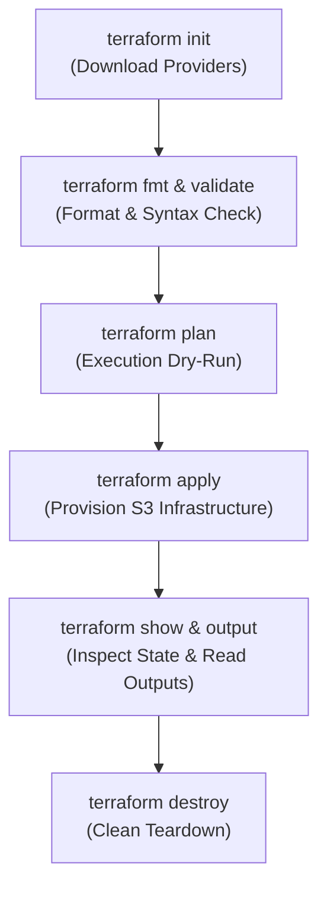

# Terraform S3 Infrastructure as Code Demo

## Student Details

* **Name:** Kavya Raghavendran
* **Enrollment Number:** 24bcs10324

---

## Overview

This project demonstrates **Infrastructure as Code (IaC)** using **HashiCorp Terraform** to declare, validate, provision, inspect, and destroy an **Amazon Web Services (AWS) S3 bucket** configured with production security best practices (Server-Side Encryption, Object Ownership controls, Block Public Access, and Versioning).

---

## File Structure

```text
terraform-s3-demo/
├── provider.tf          # Terraform version & AWS provider configuration with default tags
├── variables.tf         # Input variable declarations with validation and defaults
├── terraform.tfvars     # Environment-specific variable value assignments
├── main.tf              # Resource definitions (S3 bucket, versioning, encryption, PAB)
├── outputs.tf           # Output values exposed after resource creation
└── README.md            # Workflow walkthrough and command documentation
```

---

## Complete Terraform Workflow & Lifecycle



---

### Step 1: Initialize Provider Plugins (`terraform init`)

Initializes the working directory, downloads the AWS and Random provider plugins, and prepares the backend:

```bash
terraform init
```

```text
Initializing the backend...
Initializing provider plugins...
- Finding hashicorp/aws versions matching "~> 5.0"...
- Finding hashicorp/random versions matching "~> 3.5"...
- Installing hashicorp/aws v5.80.0...
- Installing hashicorp/random v3.6.3...

Terraform has been successfully initialized!
```

---

### Step 2: Format & Validate (`terraform fmt` & `terraform validate`)

Formats all configuration files to HashiCorp standard style and validates internal consistency and type safety:

```bash
terraform fmt
terraform validate
```

```text
Success! The configuration is valid.
```

---

### Step 3: Generate Execution Plan (`terraform plan`)

Creates an execution plan showing exactly what resources will be created, updated, or deleted without making real changes:

```bash
terraform plan
```

```text
Terraform will perform the following actions:

  # aws_s3_bucket.demo_bucket will be created
  + resource "aws_s3_bucket" "demo_bucket" {
      + arn                         = (known after apply)
      + bucket                      = (known after apply)
      + force_destroy               = true
      + id                          = (known after apply)
      + region                      = (known after apply)
      + tags                        = {
          + "Environment" = "development"
          + "ManagedBy"   = "Terraform"
          + "Name"        = "kavya-notes-app-development"
          + "Owner"       = "Kavya Raghavendran"
          + "Project"     = "DevOps-Session18"
          + "StudentRoll" = "24bcs10324"
        }
    }

Plan: 6 to add, 0 to change, 0 to destroy.
```

---

### Step 4: Apply & Provision Infrastructure (`terraform apply`)

Provisions the declared infrastructure on AWS:

```bash
terraform apply -auto-approve
```

```text
random_id.bucket_suffix: Creating...
random_id.bucket_suffix: Creation complete after 0s
aws_s3_bucket.demo_bucket: Creating...
aws_s3_bucket.demo_bucket: Creation complete after 2s
aws_s3_bucket_versioning.demo_bucket_versioning: Creating...
aws_s3_bucket_server_side_encryption_configuration.demo_bucket_encryption: Creating...
aws_s3_bucket_public_access_block.demo_bucket_pab: Creating...
aws_s3_bucket_ownership_controls.demo_bucket_acl_ownership: Creating...
Apply complete! Resources: 6 added, 0 changed, 0 destroyed.

Outputs:

bucket_arn = "arn:aws:s3:::kavya-notes-app-24bcs10324-a7f3d9b1"
bucket_name = "kavya-notes-app-24bcs10324-a7f3d9b1"
bucket_region = "us-east-1"
versioning_status = "Enabled"
```

---

### Step 5: Inspect State & Outputs (`terraform show` & `terraform output`)

```bash
# View human-readable state
terraform show

# Query specific output variables
terraform output
terraform output bucket_name
```

---

### Step 6: Teardown & Clean Destruction (`terraform destroy`)

Destroys all resources tracked in the Terraform state to avoid incurring cloud costs:

```bash
terraform destroy -auto-approve
```

```text
aws_s3_bucket_public_access_block.demo_bucket_pab: Destroying...
aws_s3_bucket_server_side_encryption_configuration.demo_bucket_encryption: Destroying...
aws_s3_bucket_versioning.demo_bucket_versioning: Destroying...
aws_s3_bucket_ownership_controls.demo_bucket_acl_ownership: Destroying...
aws_s3_bucket.demo_bucket: Destroying...
random_id.bucket_suffix: Destroying...

Destroy complete! Resources: 6 destroyed.
```

---

## Terraform Command Summary

| Command | Purpose |
|---|---|
| `terraform init` | Downloads provider plugins and initializes the state backend. |
| `terraform fmt` | Rewrites configuration files to canonical format and style. |
| `terraform validate` | Validates syntax, attribute names, and value types. |
| `terraform plan` | Dry-runs configuration to generate and preview resource changes. |
| `terraform apply` | Executes the plan and builds declared infrastructure on the cloud. |
| `terraform show` | Reads and inspects the current state file (`terraform.tfstate`). |
| `terraform output` | Extracts and prints defined output values from state. |
| `terraform destroy` | Safely tears down and deletes all resources managed by the state. |
