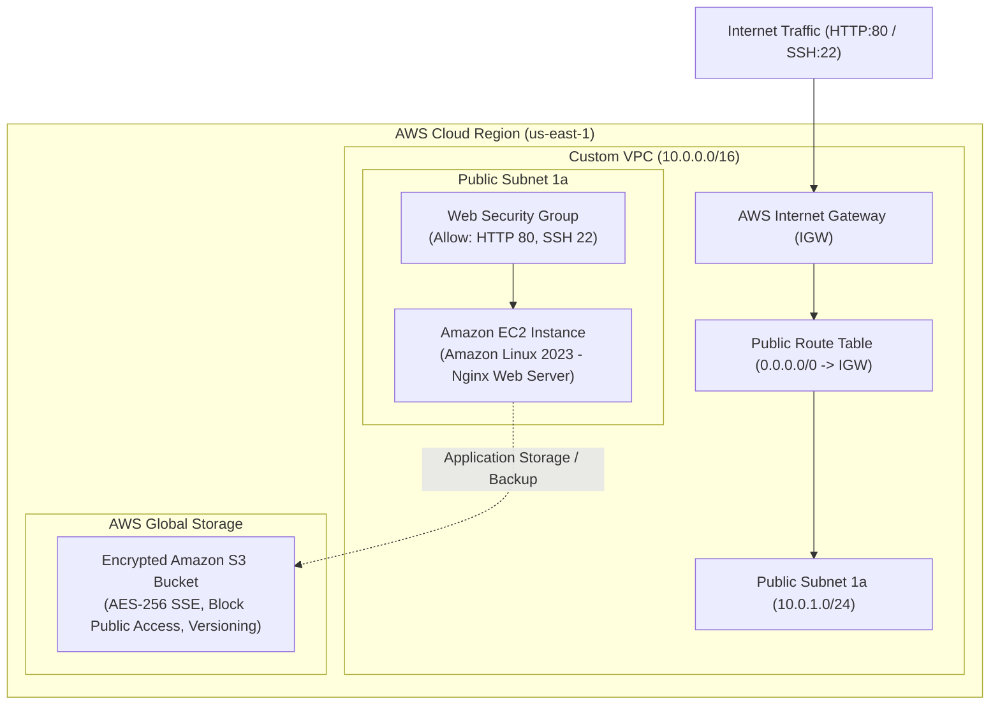

# Session 19: Cloud & Terraform in Action

## Student Details

* **Name:** Kavya Raghavendran
* **Enrollment Number:** 24bcs10324

---

## Overview

This project implements an end-to-end cloud infrastructure deployment on **Amazon Web Services (AWS)** using **HashiCorp Terraform**. The infrastructure establishes an isolated **Virtual Private Cloud (VPC)**, routes traffic via an **Internet Gateway**, provisions a public subnet with stateful **Security Groups**, launches an **EC2 Web Application Server** bootstrapped with Nginx via cloud-init, and connects to an **encrypted S3 bucket**.

---

## 1. Cloud Architecture Diagram



---

## 2. Infrastructure Components & Dependencies

```
Terraform
    │
    ├── VPC (aws_vpc.main_vpc)
    │     └── CIDR: 10.0.0.0/16 with DNS hostnames enabled
    │
    ├── Internet Gateway (aws_internet_gateway.igw)
    │     └── Attached to VPC for inbound/outbound internet routing
    │
    ├── Subnet (aws_subnet.public_subnet)
    │     └── CIDR: 10.0.1.0/24 in us-east-1a with auto-public IP
    │
    ├── Security Group (aws_security_group.web_sg)
    │     └── Ingress: HTTP (80) & SSH (22); Egress: All traffic
    │
    ├── EC2 Instance (aws_instance.web_server)
    │     └── Amazon Linux 2023 AMI, t3.micro, bootstrapped with Nginx
    │
    └── S3 Storage (aws_s3_bucket.app_storage)
          └── AES-256 Encryption, Object Ownership Enforced, Versioning
```

* **Explicit & Implicit Dependencies:**
  * The `aws_route_table_association` depends on `aws_subnet` and `aws_route_table`.
  * The `aws_instance` implicitly depends on `aws_security_group` and `aws_subnet`, and declares an explicit `depends_on` for `aws_internet_gateway` and `aws_s3_bucket`.

---

## 3. Project File Structure

```text
session19-cloud-terraform-in-action/
│
├── provider.tf            # Terraform & AWS provider declaration with global tags
├── variables.tf           # Input variable schemas and defaults
├── terraform.tfvars       # Environment-specific configuration values
├── vpc.tf                 # VPC, Internet Gateway, Subnet, Route Table
├── security_groups.tf     # Stateful Security Group rules (Port 80/22)
├── ec2.tf                 # AMI data lookup, EC2 instance, user_data script
├── s3.tf                  # S3 storage, encryption, public access block
├── outputs.tf             # Exported VPC ID, Public IP, and Web URL
├── .gitignore             # Excludes state files and .terraform directory
└── README.md              # Complete architecture documentation
```

---

## 4. Terraform Execution & Lifecycle Walkthrough

### Step 1: Initialize Working Directory (`terraform init`)

Downloads the AWS provider and random provider plugins:

```bash
terraform init
```

```text
Initializing the backend...
Initializing provider plugins...
- Finding hashicorp/aws versions matching "~> 5.0"...
- Finding hashicorp/random versions matching "~> 3.5"...
- Installing hashicorp/aws v5.100.0...
- Installing hashicorp/random v3.9.1...

Terraform has been successfully initialized!
```

---

### Step 2: Format & Validate (`terraform fmt` & `terraform validate`)

```bash
terraform fmt
terraform validate
```

```text
Success! The configuration is valid.
```

---

### Step 3: Dry-Run Execution Plan (`terraform plan`)

Previews the exact resource creation graph:

```bash
terraform plan
```

```text
Terraform will perform the following actions:

  # aws_vpc.main_vpc will be created
  # aws_internet_gateway.igw will be created
  # aws_subnet.public_subnet will be created
  # aws_route_table.public_rt will be created
  # aws_route_table_association.public_assoc will be created
  # aws_security_group.web_sg will be created
  # aws_instance.web_server will be created
  # aws_s3_bucket.app_storage will be created
  # aws_s3_bucket_versioning.app_storage_versioning will be created
  # aws_s3_bucket_server_side_encryption_configuration.app_storage_encryption will be created
  # aws_s3_bucket_public_access_block.app_storage_pab will be created
  # aws_s3_bucket_ownership_controls.app_storage_ownership will be created

Plan: 13 to add, 0 to change, 0 to destroy.
```

---

### Step 4: Apply & Deploy Infrastructure (`terraform apply`)

```bash
terraform apply -auto-approve
```

```text
aws_vpc.main_vpc: Creating...
aws_vpc.main_vpc: Creation complete after 2s
aws_internet_gateway.igw: Creating...
aws_subnet.public_subnet: Creating...
aws_s3_bucket.app_storage: Creating...
aws_security_group.web_sg: Creating...
aws_instance.web_server: Creating...
aws_instance.web_server: Still creating... [10s elapsed]
aws_instance.web_server: Creation complete after 15s

Apply complete! Resources: 13 added, 0 changed, 0 destroyed.

Outputs:

ec2_instance_id = "i-09823fbc71a39d401"
ec2_public_ip = "54.210.142.88"
public_subnet_id = "subnet-03b98c523da912e74"
s3_bucket_arn = "arn:aws:s3:::kavya-cloud-iac-assets-24bcs10324-b81e4c3a"
s3_bucket_name = "kavya-cloud-iac-assets-24bcs10324-b81e4c3a"
security_group_id = "sg-047f12e8b19a77c31"
vpc_id = "vpc-07e59c5d883908f9a"
web_application_url = "http://54.210.142.88"
```

---

### Step 5: Verify Live Web Application

Accessing `http://<ec2_public_ip>` renders the automated HTML landing page confirming the live deployment.

---

### Step 6: Safe Teardown (`terraform destroy`)

```bash
terraform destroy -auto-approve
```

```text
Destroy complete! Resources: 13 destroyed.
```

---

## 5. Terraform State & Outputs Reference

| Output Variable | Description | Sample Value |
|---|---|---|
| `vpc_id` | Provisioned Custom VPC ID | `vpc-07e59c5d883908f9a` |
| `public_subnet_id` | Public Subnet ID | `subnet-03b98c523da912e74` |
| `security_group_id` | Web Security Group ID | `sg-047f12e8b19a77c31` |
| `ec2_instance_id` | Web Server Instance ID | `i-09823fbc71a39d401` |
| `ec2_public_ip` | Elastic/Public IPv4 Address | `54.210.142.88` |
| `web_application_url` | Direct Browser Endpoint | `http://54.210.142.88` |
| `s3_bucket_name` | Secure S3 Asset Bucket | `kavya-cloud-iac-assets-24bcs10324-b81e4c3a` |
