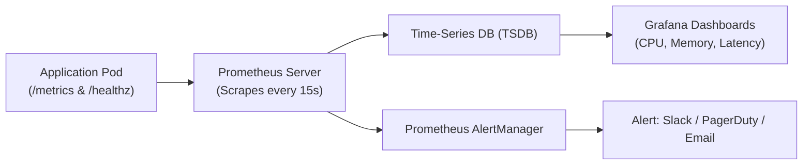
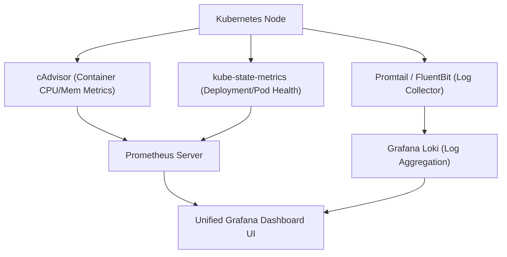
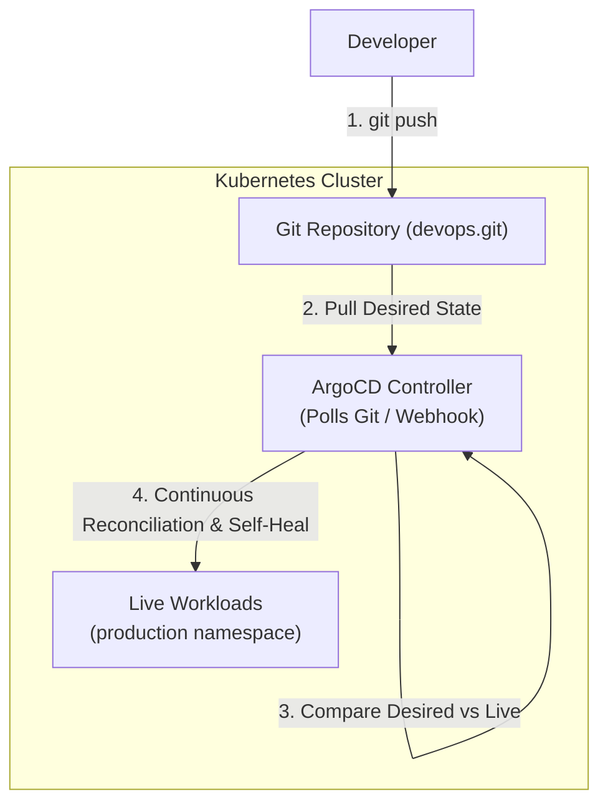

# Session 20: Monitoring, Observability & GitOps

## Student Details

* **Name:** Kavya Raghavendran
* **Enrollment Number:** 24bcs10324

---

## Overview

This module covers the operational lifecycle of modern cloud-native systems:
1. **Task 1: System & Application Monitoring** — Metrics collection, log aggregation, alerting rules, CPU/memory thresholds, and application health probes.
2. **Task 2: Observability (The Three Pillars)** — In-depth architectural analysis of **Metrics, Logs, and Traces (M.E.L.T.)**, why observability is required for distributed microservices, and Kubernetes observability stacks.
3. **Task 3: GitOps with Kubernetes** — Git as the single source of truth, declarative configuration, continuous reconciliation, automated drift detection, and pull-based deployment using **ArgoCD**.

---

## 1. Task 1: Monitoring & Application Health

Monitoring answers: *"Is the system currently working, and what are its current resource values?"*



### 1.1 Core Monitoring Primitives

| Component | Description | Example / Tool |
|---|---|---|
| **Metrics** | Numeric aggregable measurements sampled over time | CPU usage (%), Memory RSS (MB), Request Count |
| **Logs** | Discrete timestamped event messages with contextual metadata | `{"level": "INFO", "msg": "User 102 logged in"}` |
| **Alerts** | Automated notifications triggered when thresholds are breached | Alert if CPU > 80% for 5 minutes |
| **Health Checks** | Binary probes checking component viability | `/healthz` returning HTTP 200 OK |

---

### 1.2 Monitoring Demo Application ([`app/app.py`](app/app.py))

A Python Flask service instrumented with `prometheus_client` and `psutil`:

* **`GET /metrics`:** Exports Prometheus-formatted counters, gauges, and histograms:
  * `app_http_requests_total`: Tracks requests by method, endpoint, and status code.
  * `app_http_request_duration_seconds`: Request latency histogram.
  * `app_cpu_utilization_percent`: Process CPU usage gauge.
  * `app_memory_utilization_bytes`: Resident set size (RSS) memory consumption gauge.
* **`GET /healthz`:** Microservice health probe reporting CPU, memory, and database status.
* **`GET /workload/cpu`:** Simulates compute spikes to trigger CPU monitoring alerts.

```bash
# Run monitoring demo app
python3 app/app.py
```

```bash
# Query Prometheus metrics output
curl http://localhost:5000/metrics
```

```text
# HELP app_http_requests_total Total HTTP Requests
# TYPE app_http_requests_total counter
app_http_requests_total{endpoint="/",method="GET",status="200"} 5.0
# HELP app_cpu_utilization_percent Current process CPU utilization percentage
# TYPE app_cpu_utilization_percent gauge
app_cpu_utilization_percent 12.4
# HELP app_memory_utilization_bytes Current process Memory utilization in bytes
# TYPE app_memory_utilization_bytes gauge
app_memory_utilization_bytes 3.4865152e+07
```

---

### 1.3 Prometheus Alerting Rules ([`monitoring/prometheus-config.yaml`](monitoring/prometheus-config.yaml))

```yaml
groups:
  - name: application_health_alerts
    rules:
      - alert: ServiceDown
        expr: up{job="observability-demo-app"} == 0
        for: 1m
        labels: { severity: critical }
        annotations:
          summary: "Service target is unreachable"

      - alert: HighCPUUtilization
        expr: app_cpu_utilization_percent > 80
        for: 2m
        labels: { severity: warning }
        annotations:
          summary: "High CPU usage (>80%) detected"

      - alert: HighMemoryUsage
        expr: app_memory_utilization_bytes > 209715200 # >200MB
        for: 2m
        labels: { severity: warning }
        annotations:
          summary: "High memory usage detected"
```

---

### 1.4 Kubernetes Health Probes & Resource Limits ([`monitoring/k8s-metrics-deployment.yaml`](monitoring/k8s-metrics-deployment.yaml))

* **Liveness Probe:** Restarts the container if the application enters a deadlock or unresponsive state.
* **Readiness Probe:** Ensures the container does not receive incoming user traffic until it is fully warmed up.
* **Resource Requests & Limits:** Prevents noisy neighbors from exhausting node CPU/memory:
  ```yaml
  resources:
    requests: { cpu: "100m", memory: "128Mi" }
    limits:   { cpu: "500m", memory: "256Mi" }
  ```

---

## 2. Task 2: Observability (The Three Pillars)

Observability answers: *"Why is the system behaving this way, and what is the root cause of an unexpected failure?"*

```
                         OBSERVABILITY
                               │
            ┌──────────────────┼──────────────────┐
            ▼                  ▼                  ▼
         METRICS              LOGS              TRACES
    (What is broken?)   (Why is it broken?) (Where is it broken?)
            │                  │                  │
    Numeric Time-Series    Structured Event       End-to-End Request
    Aggregations           Records                Lifecycles
            │                  │                  │
    Prometheus / Datadog   Grafana Loki / ELK     Jaeger / OpenTelemetry
```

---

### 2.1 Deep-Dive: The Three Pillars

| Pillar | Characteristics | Best Used For | Tooling Ecosystem |
|---|---|---|---|
| **Metrics** | Low-overhead numeric time-series data indexed by key-value labels | Real-time alerting, dashboards, resource capacity trends, SLO/SLA tracking | Prometheus, VictoriaMetrics, Datadog |
| **Logs** | Granular, discrete event records with stack traces and parameters | Investigating exact error messages, security audits, debugging post-alert | Grafana Loki, Fluentd, Elastic/Kibana (ELK) |
| **Traces** | Distributed request lifecycles with unique TraceIDs and Span timings across microservices | Pinpointing network bottlenecks, latency spikes in distributed calls | OpenTelemetry (OTel), Jaeger, Zipkin |

---

### 2.2 Why is Observability Required?

1. **Distributed Microservices Complexity:** Monolithic stack traces no longer work when a single user request traverses 15 different Kubernetes services. Tracing connects the dots across network boundaries.
2. **Handling "Unknown Unknowns":** Traditional monitoring only checks things you anticipated (e.g. CPU > 80%). Observability allows engineers to query arbitrary system states to debug issues they have never seen before.
3. **Reducing MTTR (Mean Time to Resolution):** Correlating metrics spikes $\rightarrow$ filtering relevant logs by TraceID $\rightarrow$ inspecting span waterfall graphs allows debugging in minutes rather than hours.

---

### 2.3 Kubernetes Observability Stack Architecture



---

## 3. Task 3: GitOps (Git as the Source of Truth)

**GitOps** is an operational framework that takes DevOps best practices used for application development (version control, collaboration, compliance, and CI) and applies them to infrastructure automation and Kubernetes application deployment.

---

### 3.1 Core Principles of GitOps

1. **Declarative Everything:** The entire desired state of the system is described declaratively in Git (YAML manifests, Helm charts, Kustomize).
2. **Git as the Single Source of Truth:** Changes are made exclusively via Git commits and Pull Requests, providing an immutable audit log.
3. **Automated Continuous Reconciliation:** In-cluster software agents (operators) continuously compare the **Desired State** in Git against the **Live State** in the cluster.
4. **Self-Healing & Drift Correction:** If someone manually runs `kubectl edit` or deletes a pod, the GitOps operator automatically detects configuration drift and reverts the cluster back to match Git.

---

### 3.2 Push-Based CI/CD vs Pull-Based GitOps

| Dimension | Push-Based CI/CD (Traditional) | Pull-Based GitOps (ArgoCD / Flux) |
|---|---|---|
| **Execution** | External CI server (GitHub Actions/Jenkins) runs `kubectl apply` | Internal in-cluster operator pulls and reconciles manifests |
| **Cluster Access** | Requires storing high-privilege `kubeconfig` / cluster admin secrets in CI | Zero external cluster credentials; operator runs inside the cluster |
| **Drift Handling** | Blind to cluster changes until next pipeline trigger | Continuous automated drift detection and self-healing in real-time |
| **Rollbacks** | Requires rerunning deployment pipelines | Simple `git revert <commit-id>` instantly syncs cluster |

---

### 3.3 GitOps Architecture & Workflow



---

### 3.4 ArgoCD Application Manifest ([`gitops/argocd-application.yaml`](gitops/argocd-application.yaml))

```yaml
apiVersion: argoproj.io/v1alpha1
kind: Application
metadata:
  name: notes-app-gitops
  namespace: argocd
  finalizers:
    - resources-finalizer.argocd.argoproj.io
spec:
  project: default
  source:
    repoURL: 'https://github.com/Kavya100206/devops.git'
    targetRevision: HEAD
    path: 'session20-monitoring-observability-gitops/gitops/app-manifests'
  destination:
    server: 'https://kubernetes.default.svc'
    namespace: production
  syncPolicy:
    automated:
      prune: true      # Deletes resources removed from Git
      selfHeal: true   # Overwrites manual cluster drift to match Git
    syncOptions:
      - CreateNamespace=true
```

---

## 4. Summary Matrix: Monitoring vs Observability vs GitOps

| Domain | Core Question | Primary Focus | Key Technologies |
|---|---|---|---|
| **Monitoring** | *"Is the service healthy right now?"* | Dashboards, alerting thresholds, system availability | Prometheus, AlertManager, Node Exporter |
| **Observability** | *"Why is the service failing or slow?"* | High-cardinality exploratory analysis, distributed tracing | OpenTelemetry, Jaeger, Grafana Loki, Tempo |
| **GitOps** | *"How do we reliably deploy and maintain desired state?"* | Declarative infrastructure, continuous reconciliation, automated drift self-healing | ArgoCD, Flux, Git, Kubernetes CRDs |
